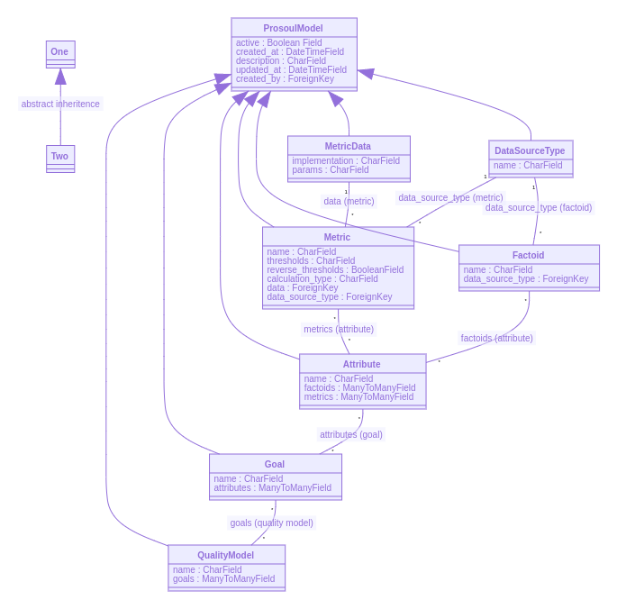

Hello everyone

Here I am back with the work update of the final week of community bonding. I had a project meeting with my mentors last Thursday, [2020-05-28-community-bonding-4.txt](https://github.com/vchrombie/gsoc/blob/master/meetings/2020-05-28-community-bonding-4.txt).

I planned to continue working with the `gitlabcomments` enricher which I started last week. As this is most similar to the `github2` enricher, I tested it across a few repositories and analyzed the enriched items and the dashboards. 📉

I did a comparison of the github and gitlab perceval output to know more about the two APIs like similar items, different items, items that vary according to the features of the software which are fetched in each of the backends. I started implementing the functions for enriching the issue items and opened a draft PR too, [chaoss/grimoirelab-elk#881](https://github.com/chaoss/grimoirelab-elk/pull/881). I will work on completing this, in the coming weeks.

Apart from that, I had a few tasks pending for the community bonding period. I worked on completing the tasks. One task was creating a UML diagram for the existing implementation of Prosoul. I have a decent understanding of the codebase. So, I went ahead and created one. 👇

[UML diagram SVG | Prosoul](https://mermaid.ink/svg/eyJjb2RlIjoiY2xhc3NEaWFncmFtXG4gIFByb3NvdWxNb2RlbCA8fC0tIFF1YWxpdHlNb2RlbFxuICBQcm9zb3VsTW9kZWwgPHwtLSBHb2FsXG4gIFByb3NvdWxNb2RlbCA8fC0tIEF0dHJpYnV0ZVxuICBQcm9zb3VsTW9kZWwgPHwtLSBNZXRyaWNcbiAgUHJvc291bE1vZGVsIDx8LS0gRmFjdG9pZFxuICBQcm9zb3VsTW9kZWwgPHwtLSBNZXRyaWNEYXRhXG4gIFByb3NvdWxNb2RlbCA8fC0tIERhdGFTb3VyY2VUeXBlXG4gIE1ldHJpY0RhdGEgXCIxXCIgLS0gXCIqXCIgTWV0cmljIDogZGF0YSAobWV0cmljKVxuICBEYXRhU291cmNlVHlwZSBcIjFcIiAtLSBcIipcIiBNZXRyaWMgOiBkYXRhX3NvdXJjZV90eXBlIChtZXRyaWMpXG4gIERhdGFTb3VyY2VUeXBlIFwiMVwiIC0tIFwiKlwiIEZhY3RvaWQgOiBkYXRhX3NvdXJjZV90eXBlIChmYWN0b2lkKVxuICBNZXRyaWMgXCIqXCIgLS0gXCIqXCIgQXR0cmlidXRlIDogbWV0cmljcyAoYXR0cmlidXRlKVxuICBGYWN0b2lkIFwiKlwiIC0tIFwiKlwiIEF0dHJpYnV0ZSA6IGZhY3RvaWRzIChhdHRyaWJ1dGUpXG4gIEF0dHJpYnV0ZSBcIipcIiAtLSBcIipcIiBHb2FsIDogYXR0cmlidXRlcyAoZ29hbClcbiAgR29hbCBcIipcIiAtLSBcIipcIiBRdWFsaXR5TW9kZWwgOiBnb2FscyAocXVhbGl0eSBtb2RlbClcbiAgUHJvc291bE1vZGVsIDogYWN0aXZlIDogQm9vbGVhbiBGaWVsZFxuICBQcm9zb3VsTW9kZWwgOiBjcmVhdGVkX2F0IDogRGF0ZVRpbWVGaWVsZFxuICBQcm9zb3VsTW9kZWwgOiBkZXNjcmlwdGlvbiA6IENoYXJGaWVsZFxuICBQcm9zb3VsTW9kZWwgOiB1cGRhdGVkX2F0IDogRGF0ZVRpbWVGaWVsZFxuICBQcm9zb3VsTW9kZWwgOiBjcmVhdGVkX2J5IDogRm9yZWlnbktleVxuICBBdHRyaWJ1dGUgOiBuYW1lIDogQ2hhckZpZWxkXG4gIEF0dHJpYnV0ZSA6IGZhY3RvaWRzIDogTWFueVRvTWFueUZpZWxkXG4gIEF0dHJpYnV0ZSA6IG1ldHJpY3MgOiBNYW55VG9NYW55RmllbGRcblx0RGF0YVNvdXJjZVR5cGUgOiBuYW1lIDogQ2hhckZpZWxkXG4gIEZhY3RvaWQgOiBuYW1lIDogQ2hhckZpZWxkXG4gIEZhY3RvaWQgOiBkYXRhX3NvdXJjZV90eXBlIDogRm9yZWlnbktleVxuICBHb2FsIDogbmFtZSA6IENoYXJGaWVsZFxuICBHb2FsIDogYXR0cmlidXRlc1x0OiBNYW55VG9NYW55RmllbGRcbiAgTWV0cmljIDogbmFtZSA6IENoYXJGaWVsZFxuICBNZXRyaWMgOiB0aHJlc2hvbGRzIDogQ2hhckZpZWxkXG4gIE1ldHJpYyA6IHJldmVyc2VfdGhyZXNob2xkcyA6IEJvb2xlYW5GaWVsZFxuICBNZXRyaWMgOiBjYWxjdWxhdGlvbl90eXBlIDogQ2hhckZpZWxkXG4gIE1ldHJpYyA6IGRhdGEgOiBGb3JlaWduS2V5XG4gIE1ldHJpYyA6IGRhdGFfc291cmNlX3R5cGUgOiBGb3JlaWduS2V5XG4gIE1ldHJpY0RhdGEgOiBpbXBsZW1lbnRhdGlvbiA6IENoYXJGaWVsZFxuICBNZXRyaWNEYXRhIDogcGFyYW1zIDogQ2hhckZpZWxkXG4gIFF1YWxpdHlNb2RlbCA6IG5hbWUgOiBDaGFyRmllbGRcbiAgUXVhbGl0eU1vZGVsIDogZ29hbHMgOiBNYW55VG9NYW55RmllbGRcbiAgT25lIDx8LS0gVHdvIDogYWJzdHJhY3QgaW5oZXJpdGVuY2VcbiIsIm1lcm1haWQiOnsidGhlbWUiOiJkZWZhdWx0In0sInVwZGF0ZUVkaXRvciI6ZmFsc2V9)

I still have to make a few activity diagrams for simple workflows of Prosoul like creating a quality model, making an assessment. I have it on my check-list. ☑️

I have explored how to create a study index. 

In the meeting, I also made a few plans for the first coding period. We decided to start implementing the first enricher of (gitlab) whose output is processable by Prosoul. I will start working on this during the first week of coding period 1. 🙆‍♂️

If you have any comments or questions, please make sure to comment down below. :)
