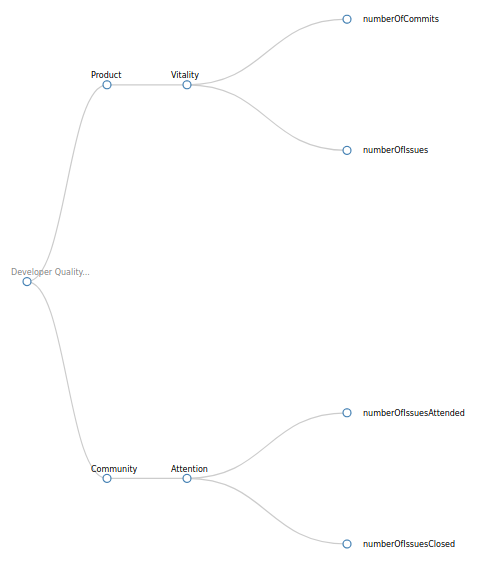

#### Coding Period 1, Week 4: Made our first test assessments 🤺.

Hello Everyone,

Welcome to the report of the fourth and also the last week in the first coding period phase. We had a video call this week instead of a regular IRC meeting, as I was expecting to show a demo of the work done until now. I couldn't complete the demo as I had some technical issues on in the last minute on my side. Anyway, I planned to record the demo soon. We had planned a few things for the upcoming week, [2020-06-25-coding-period-1-week-4.md](https://github.com/vchrombie/gsoc/blob/master/meetings/2020-06-25-coding-period-1-week-4.md).

This week, I completed working _gitlabqm_ enricher and also the _gitqm_ enricher. Things got pretty easy as I have a working enricher whose enriched items are consumed by Prosoul, we can perform assessments with them too. 🕺

I started speeding up the process. We discussed about the possible metrics that can be extracted from the gitlab ([vchrombie/gsoc#8](https://github.com/vchrombie/gsoc/issues/8)) and git ([vchrombie/gsoc#9](https://github.com/vchrombie/gsoc/issues/9)) raw data. I worked on implementing all the planned metrics. 👾 [vchrombie/gsoc#6](https://github.com/vchrombie/gsoc/issues/6),  PR 👉 [chaoss/grimoirelab-elk#902](https://github.com/chaoss/grimoirelab-elk/pull/902)
    
- _gitlabqm_: 
    - issues
        - numberCreatedIssues
        - numberClosedIssues
        - numberIssueComments
    - merges
        - numberCreatedMerges
        - numberClosedMerges
        - numberMergedMerges
        - numberMergeComments
- _gitqm_: 
    - commits
        - numberCommitsCreated
        - numberLinesAdded
        - numberLinesRemoved
        - numberActions
        - numberFilesChanged

Now that we have two enrichers working, I've decided to play with Prosoul using the extracted metrics data. I've executed the raw and enrich tasks using micro-mordred and completed enriching items of around eight projects of [GitLab.org](https://gitlab.com/gitlab-org). The project list and configurations can be viewed here, [configurations gist](https://gist.github.com/vchrombie/65824c47c0d22005a9520583856e993e). 

projects.json
```json
{
    "potioncraft" : {
        "gitqm": [
            "https://gitlab.com/gitlab-org/gitlab-styles.git",
            "https://gitlab.com/gitlab-org/gitlab-orchestrator.git",
            "https://gitlab.com/gitlab-org/gitlab-figma-plugin.git",
            "https://gitlab.com/gitlab-org/gitlab-eslint-config.git",
            "https://gitlab.com/gitlab-org/gitlab-mail_room.git",
            "https://gitlab.com/gitlab-org/gitlab-markup.git",
            "https://gitlab.com/gitlab-org/gitlab-sketch-plugin.git",
            "https://gitlab.com/gitlab-org/gitlab-terminal.git"
        ],
        "gitlabqm:issue": [
            "https://gitlab.com/gitlab-org/gitlab-styles",
            "https://gitlab.com/gitlab-org/gitlab-orchestrator",
            "https://gitlab.com/gitlab-org/gitlab-figma-plugin",
            "https://gitlab.com/gitlab-org/gitlab-eslint-config",
            "https://gitlab.com/gitlab-org/gitlab-mail_room",
            "https://gitlab.com/gitlab-org/gitlab-markup",
            "https://gitlab.com/gitlab-org/gitlab-sketch-plugin",
            "https://gitlab.com/gitlab-org/gitlab-terminal"
        ],
        "gitlabqm:merge": [
            "https://gitlab.com/gitlab-org/gitlab-styles",
            "https://gitlab.com/gitlab-org/gitlab-orchestrator",
            "https://gitlab.com/gitlab-org/gitlab-figma-plugin",
            "https://gitlab.com/gitlab-org/gitlab-eslint-config",
            "https://gitlab.com/gitlab-org/gitlab-mail_room",
            "https://gitlab.com/gitlab-org/gitlab-markup",
            "https://gitlab.com/gitlab-org/gitlab-sketch-plugin",
            "https://gitlab.com/gitlab-org/gitlab-terminal"
        ]
    }
}
```

setup.cfg
```
[gitqm]
raw_index = gitqm_raw
enriched_index = qm_enriched
category = commit

[gitlabqm:issue]
api-token = xxxx
raw_index = gitlabqm-issues_raw
enriched_index = qm_enriched
sleep-for-rate = true
category = issue
no-archive = true

[gitlabqm:merge]
api-token = xxxx
raw_index = gitlabqm-merge_raw
enriched_index = qm_enriched
sleep-for-rate = true
category = merge_request
no-archive = true
```

I have used the [Developer QM](https://github.com/Bitergia/prosoul/blob/master/django-prosoul/prosoul/data/developer_model.json) to perform an assessment. The results were better. 👌



I made a custom QM with all the metrics extracted until now. Well, this was just for the demo that doesn't make much sense with the actual meaning of Quality Models.


I also worked on improving the existing dashboard to have a better understanding of the enriched data. I've made a common dashboard for all the enrichers and added filters to manage the results. 🤹 [vchrombie/gsoc#5 (comment)](https://github.com/vchrombie/gsoc/issues/5#issuecomment-650801826)


Next week, we will be working with some organizations and make some good Quality Models, test the projects of the org, and work on displaying the results. 

If you have any comments or questions, please make sure to comment down below. :)
