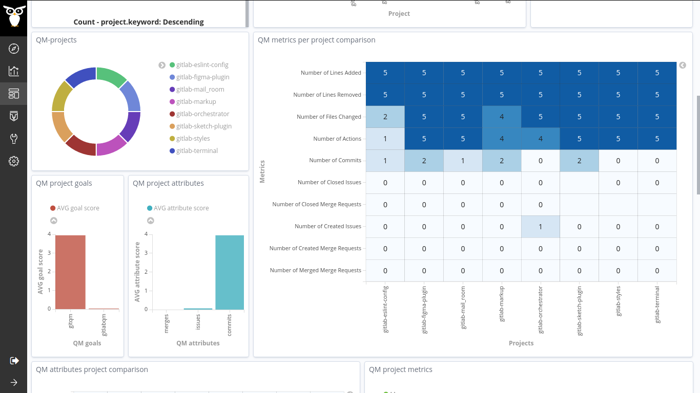

#### Coding Period 2, Week 5: Made the initial results dashboard 📊.

I hope you are doing great. I'm back with another major update of the first coding period. So, the fifth week of the coding period is completed. This week is also the first evaluation period. I'm happy to share that I passed the first-evaluation successfully. 🎉

We had a meeting, [2020-07-02-coding-period-1-week-5.txt](https://github.com/vchrombie/gsoc/blob/master/meetings/2020-07-02-coding-period-1-week-5.txt), on last Thursday and discussed the next week plans.

This week, I planned to work on the dashboard 📊 of the assessment results that we achieved last week. I uploaded all the enriched data using micro-mordred to the new grimoirelab-incubator so that it will be easy to get feedback while working on the dashboards. Thanks to Valerio, who helped a lot to get started with the incubator, and I learned how to manage the indices, adding aliases that made the work easier & efficient.

There was an existing dashboard related to the Quality Models in the crossminer project, [scava-qm dashboard](http://crossminer.bitergia.net/app/kibana#/dashboard/72ac14b0-456e-11e9-a208-9748f08b9341). I took this as a reference ✊, and I replicated the visualizations with the current results obtained in the last week.

After a lot of debugging and fixing bugs, the dashboard was ready. I got it reviewed by the mentors and made a few suggestions accordingly.
  
  
  
  

Also, while performing a basic pilot study on a few sets of projects last week, I realized 💭 we could have two more additional metrics in the gitlab raw data. They are numberIssuesAttended and numberMergesAttended. These are slightly different from numberIssueComments and numberMergeComments. After a bit of discussion, we could conclude, we can add these metrics too to the existing set with clear definitions. [vchrombie/gsoc#8](https://github.com/vchrombie/gsoc/issues/8)
  - numberIssuesAttended: the number of issues per day that have at least one comment, which is not written by the issue reporter
  - numberMergesAttended: the number of merges per day that have at least one comment, which is not written by the merge author

Next week, I'll be performing a pilot study on the [amfoss](https://gitlab.com/amfoss) projects using the enrichers implemented so far. I'm sure it would be an interesting study. I'll update you on the details and results in the upcoming blog posts.

If you have any comments or questions, please make sure to comment down below. :)
