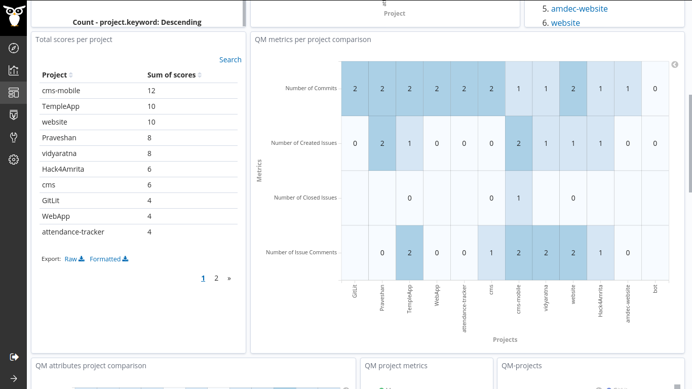

#### Coding Period 2, Week 6: First Pilot Study on amFOSS 🛩️.

We completed the sixth week of the coding period and we are already into the second coding phase. We had a meeting last Thursday about the updates and the next work. You can find the log here, [2020-07-09-coding-period-2-week-6.txt](https://github.com/vchrombie/gsoc/blob/master/meetings/2020-07-09-coding-period-2-week-6.txt).

I was planning to work on the pilot study this week. So, I have discussed with the mentors and decided to perform a study on the [amFOSS](https://amfoss.in/) projects as I'm a bit familiar with the projects and I have an understanding of their growth. [vchrombie/gsoc#13](https://github.com/vchrombie/gsoc/issues/13)

For this pilot study, I have selected 12 projects of the [amFOSS](https://gitlab.com/amfoss/) organization.
1. [Vidyaratna](https://gitlab.com/amfoss/vidyaratna)
2. [Praveshan](https://gitlab.com/amfoss/Praveshan)
3. [Hack4Amrita](https://gitlab.com/amfoss/Hack4Amrita)
4. [GitLit](https://gitlab.com/amfoss/GitLit)
5. [amdec-website](https://gitlab.com/amfoss/amdec-website)
6. [website](https://gitlab.com/amfoss/WebApp)
7. [WebApp](https://gitlab.com/amfoss/vidyaratna)
8. [cms](https://gitlab.com/amfoss/cms)
9. [cms-mobile](https://gitlab.com/amfoss/cms-mobile)
10. [TempleApp](https://gitlab.com/amfoss/TempleApp)
11. [bot](https://gitlab.com/amfoss/bot)
12. [attendance-tracker](https://gitlab.com/amfoss/attendance-tracker)

I used two data sources gitlab and git (qm enrichers). I have used the Developer Quality Model, which has 2 goals and 4 metrics.
 	
- Developer Quality Model
	- Product
		- Vitality
			- numberOfCommits
			- numberOfIssues
	- Community
		- Attention
			- numberOfIssuesAttended
			- numberOfIssuesClosed

Then I performed the raw-enrich tasks using the micro-mordred. The enriched items are stored in the respective indexes. I added an alias to all the indexes so that I can use it for assessment. I performed the assessment using Prosoul. The dashboard showed the results too.

Apart from that, I worked on the _pipermailqm_. I was able to finish the easy metrics ([vchrombie/gsoc#11](https://github.com/vchrombie/gsoc/issues/11)), number of emails per day and number of users who sent mail per day. I'll be working on the implementation of other metrics and new, meetup, enricher.

We are planning to perform another pilot study 🧐 on all the projects of the [GitLab.org](https://gitlab.com/gitlab-org/) projects in the coming weeks.

If you have any comments or questions, please make sure to comment down below. :)
