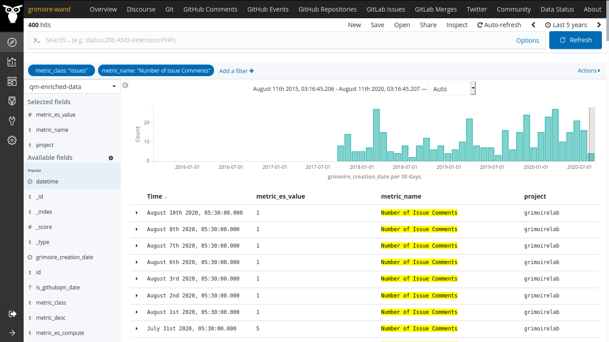
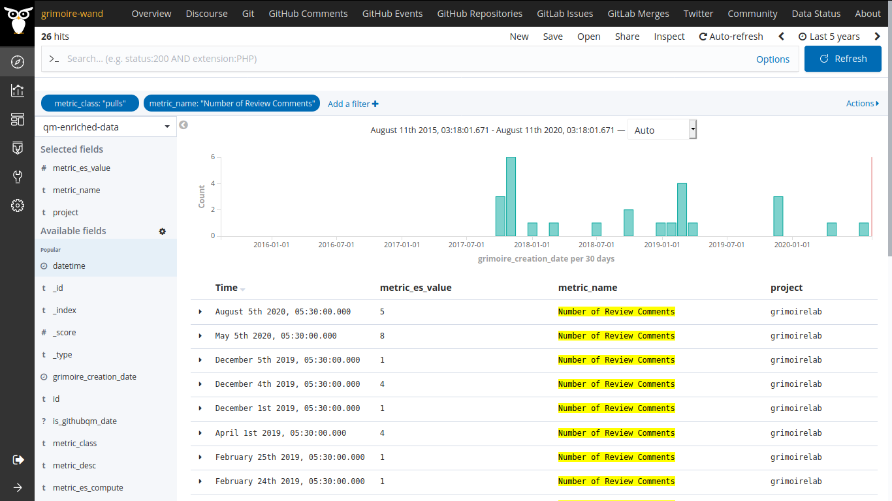

#### Coding Period 3, Week 10: Last Enricher >> GitHub ☃️.

Hello guys, here is another update about the project, and we completed the tenth week of the coding period. We had a meeting last Thursday and discussed the work, which is going pretty well. You can check the logs here, [2020-08-06-coding-period-3-week-10.txt](https://github.com/vchrombie/gsoc/blob/master/meetings/2020-08-06-coding-period-3-week-10.txt).

I was focusing on writing down 📝 results obtained from the gitlab pilot study 🚁 performed last week. [vchrombie/gsoc#13 (comment)](https://github.com/vchrombie/gsoc/issues/13#issuecomment-669236168)

Apart from that, I also worked on implementing _githubqm_ enricher. All the enrichers, planned so far, are implemented. 💯

The metrics would be almost the same ones for the _gitlabqm_ enricher. There is one minor change in the Pull Requests Comments. The comments data can be obtained as review comments in github raw data (this comes from the API). The PR comments and review comments are different. I followed this, keeping _github2_ (github comments) enricher of GrimoireLab-ELK in mind. [vchrombie/gsoc#19](https://github.com/vchrombie/gsoc/issues/19)

The implemented metrics are
- number of issues created
- number of issues closed
- number of pull requests created
- number of pull requests closed
- number of pull requests merged
- number of issue comments
- number of review comments
- number of issues attended
- number of pull requests reviewed

For the next week, I'm planning to start with the documentation work of the project. As we now have the _githubqm_ enricher, I'm planning to perform a pilot study on CHAOSS projects.

If you have any comments or questions, please make sure to comment down below. :)
