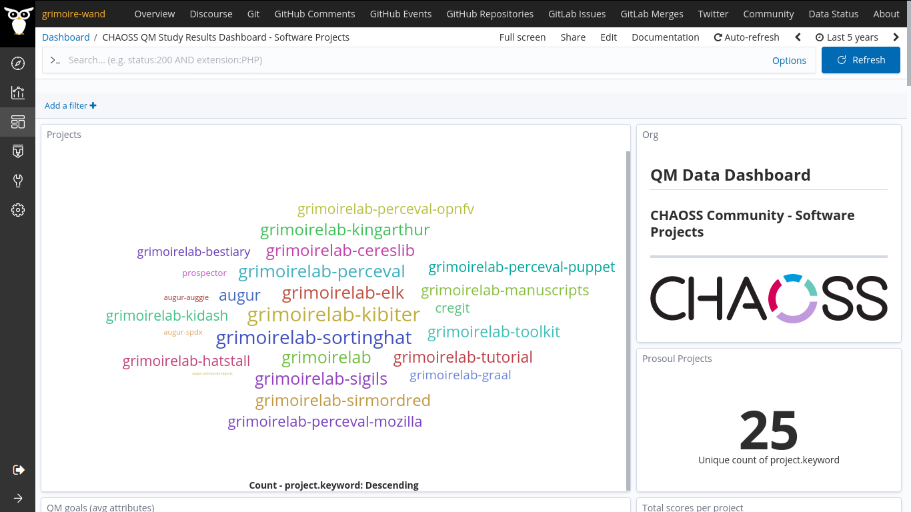
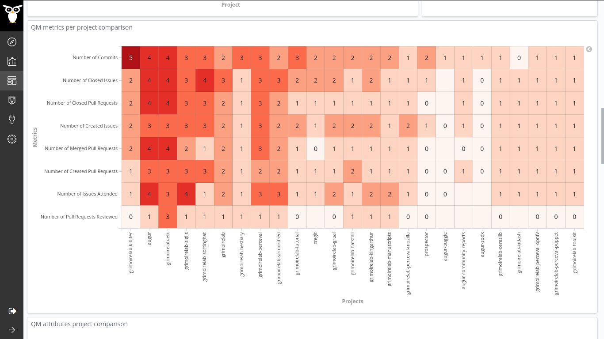

#### Coding Period 3, Week 11: Third Pilot Study on CHAOSS ✈️.

We have completed the eleventh week of the coding period (third phase). We had a meeting last Thursday about the updates and the next work. You can find the log here, [2020-08-13-coding-period-3-week-11.txt](https://github.com/vchrombie/gsoc/blob/master/meetings/2020-08-13-coding-period-3-week-11.txt).

This week, I concentrated on working on the CHAOSS study and also for the documentation of the project. As the planned enrichers are in place, it was the right time for the pilot study ✈️ on the CHAOSS Community projects. The targetted data sources are git and github repositories.

The CHAOSS projects consist of metric working groups and software projects. The functioning and activity of both categories are unalike. So, comparing a metric working group project with a software project wouldn't show great results. For this reason, I had separated the [projects list](https://gitlab.com/Bitergia/c/CHAOSS/sources/-/master/projects.json) and divided them into two categories.
  - Software Projects (GrimoireLab, Augur, Cregit, Prospector)
  - Metric WG (Risk, D&I, Value, Commons, Evolution, and App Eco System)

I performed individual assessments for the two different categories. Also, this time, I have considered the data range to allocate meaningful thresholds to each metric (software project study threshold is "1,5,10,20,50", metrics wg study threshold is "5,10,15,20,50"). Thanks to Valerio, who made me realize this characteristic from the results of the previous pilot study 🚁.  [vchrombie/gsoc#13 (comment)](https://github.com/vchrombie/gsoc/issues/13#issuecomment-674578813)

I have tailored a specific quality model for this purpose.
- developer-qm-chaoss
  - product
    - vitality
      - number of commits
      - number of issues
      - number of pull requests
  - community
    - issue-attention
      - number of issues attended
      - number of issues closed
    - pr-attention
      - number of pull requests reviewed
      - number of pull requests closed
      - number of pull requests merged

Metrics Working Groups Study [vchrombie/gsoc#13 (comment)](https://github.com/vchrombie/gsoc/issues/13#issuecomment-674579035)

Software Projects Study [vchrombie/gsoc#13 (comment)](https://github.com/vchrombie/gsoc/issues/13#issuecomment-674579264)

Well, there can be many improvements to the study. The metrics might not suit 100% for comparing the working group activity. I understand that most of the discussions happen in the mailing lists and/or weekly meetings. I'm interested in discussing the metrics that can be applied to measure the activity of the Metrics WG and re-work on this, maybe after the coding period.

I also worked on the documentation of the project. The best place 🗺️ for this could be the [Bitergia/prosoul](https://github.com/Bitergia/prosoul) repository. But, we planned to have a README.md inside the QM folder of [chaoss/grimoirelab-elk](https://github.com/chaoss/grimoirelab-elk/). [vchrombie/gsoc#20](https://github.com/vchrombie/gsoc/issues/20)

I submitted a PR for adding the dashboard to the [chaoss/grimoirelab-sigils](https://github.com/chaoss/grimoirelab-sigils) repository. I need to complete the dashboard documentation to finalize the PR. I have to finalize the PR, finish the documentation work, and then make some tutorial, walk-through videos for the next week.

If you have any comments or questions, please make sure to comment down below. :)
