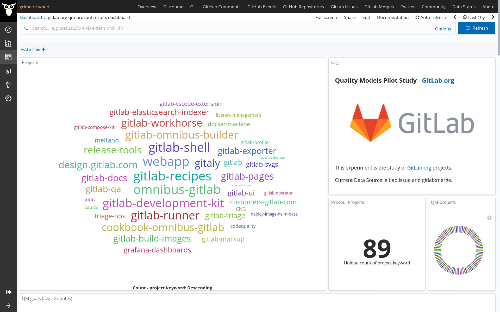
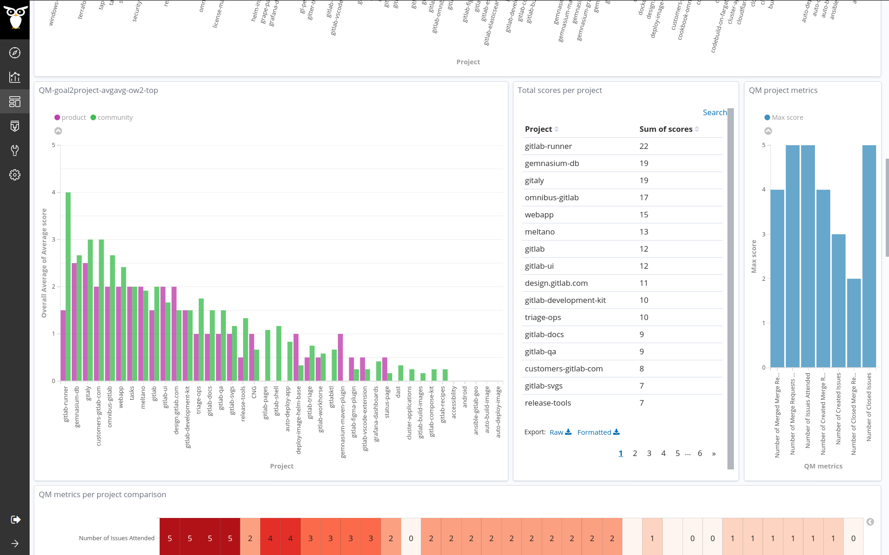
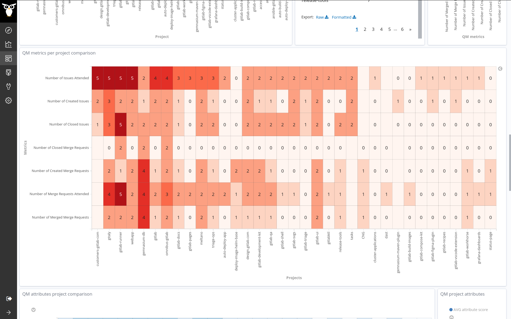
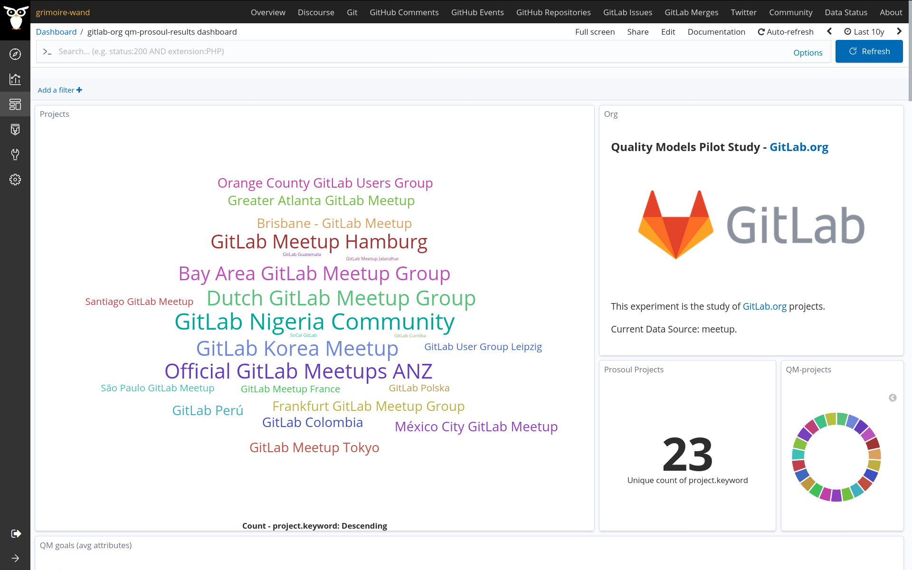
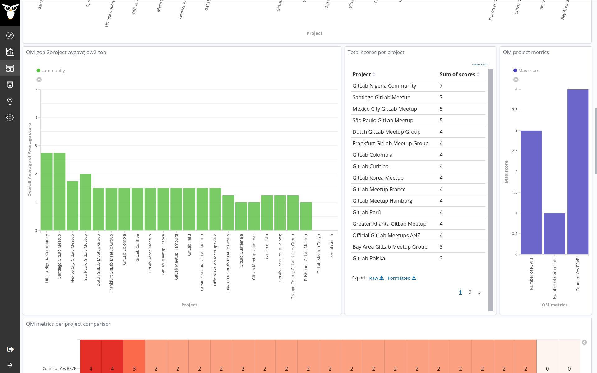
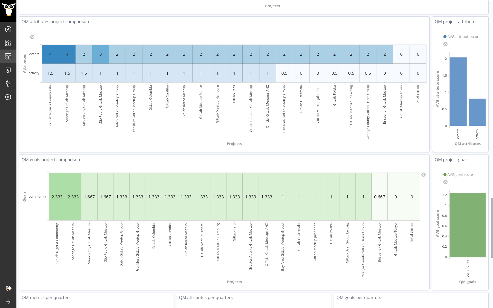

#### Coding Period 2, Week 9: Second Pilot Study on GitLab.org 🚁.

Thanks for checking the blog post. The ninth coding week is over. I would also like to share that I have passed the second evaluation too. 🎉

We had a short meeting last Thursday and discussed a few plans regarding the next work, [2020-07-30-coding-period-2-week-9.txt](https://github.com/vchrombie/gsoc/blob/master/meetings/2020-07-30-coding-period-2-week-9.txt).

I was planning to work on the pilot study on the GitLab.org projects this week. [vchrombie/gsoc#13](https://github.com/vchrombie/gsoc/issues/13)

We decided to target gitlab and meetup data sources. Valerio helped a lot with collecting the raw data in the incubator. The [projects.json](https://gitlab.com/Bitergia/c/gitlab/sources/-/blob/master/projects.json) file is already available. 

**NOTE**: We had to skip a few big repositories as we need more time and resources for computing all the projects. The skipped projects are _gitlab-org/gitlab-foss_, _gitlab-org/www-gitlab-com_ and _gitlab-org/gitlab_.

This study is going to be different as the projects list for the two data sources (gitlab and meetup) is not similar. The gitlab data source has data regarding the software projects and, the meetup has the data regarding the events and meetups. So, to tackle this challenge ⚔️, we have to perform two individual assessments. Because if we combine both these un-related projects list, we might not obtain good results.

I tailored 🧶 two new versions of the Developer Quality Model for both the data sources.

- developer-qm-gitlab
	- product
		- vitality
			- number of issues
			- number of merge requests
	- community
		- issues-attention
			- number of issues attended
			- number of issues closed
		- mrs-attention
			- number of merge requests attended
			- number of merge requests closed
			- number of merge requests merged

- developer-qm-meetup
	- community
		- events
			- count of yes rsvp
		- activity
			- number of comments
			- number of rsvps

Then I performed the enrich task on the gitlab raw data that is readily available in the incubator. The enriched items will be useful for assessments. The dashboard shows the results.

A similar procedure has followed for the meetup data source. The dashboard shows the results.

You can check more results from here, [vchrombie/gsoc#13 (comment)](https://github.com/vchrombie/gsoc/issues/13#issuecomment-669236168).

We planned to work on the _githubqm_ enricher. It would probably be the last enricher I would be working. Also, I'm planning a final pilot study on the CHAOSS Community projects.

If you have any comments or questions, please make sure to comment down below. :)
