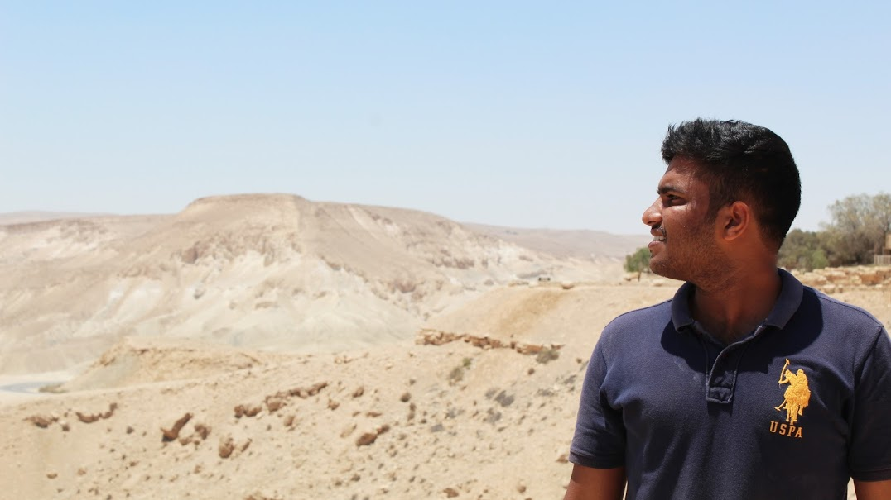
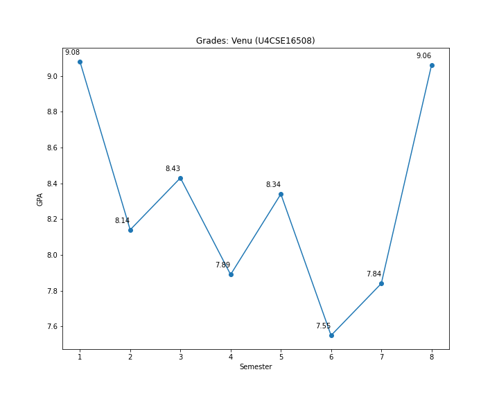
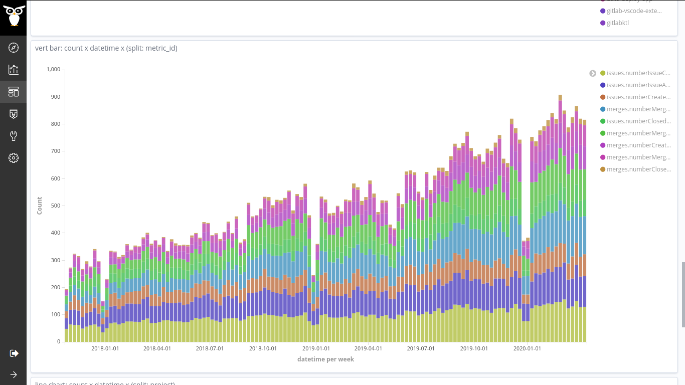
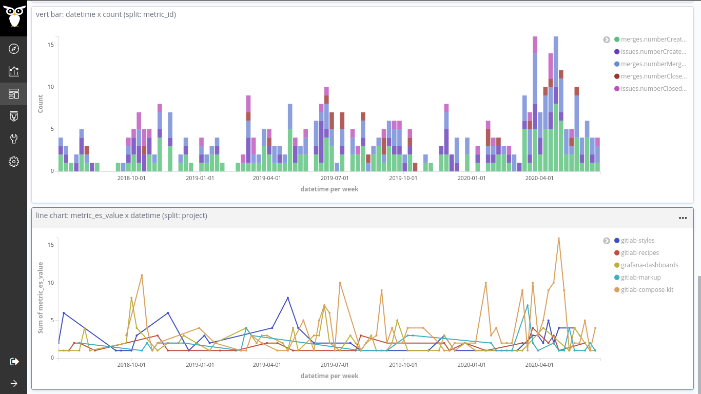
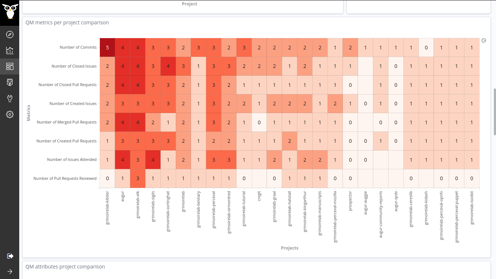

My Name is Venu Vardhan Reddy Tekula, currently working as a Backend Developer at [Bitergia](https://bitergia.com/).

I worked as a Student Developer ([Google Summer of Code](https://summerofcode.withgoogle.com/) 2020 participant) with 
[CHAOSS](https://chaoss.community/), a Linux Foundation Project and Bitergia, implementing the bridge between [GrimoireLab](https://github.com/chaoss/grimoirelab) & 
[Prosoul](https://github.com/Bitergia/prosoul) and providing a workflow to evaluate projects using the Quality Models. You can read the work final report from here, 
[reporte final](https://vchrombie.github.io/blog/gsoc-final-report/).

I completed my undergraduate studies in CSE at 
[Amrita Vishwa Vidyapeetham](https://www.amrita.edu/), Kollam. I am also a member of 
[amFOSS](https://amfoss.in/), the Open Source club of Amrita. I mentor students and help them to pull up their first contribution to Open Source. I can teach them the difference between Git and GitHub.

I like to travel and cook. I usually play with data, plot graphs with them and show the results to people. 🕵️‍♂️

The below plot is the status update trend of [Ashwin R](https://ashwinkey04.github.io/). 🧐

Rollercoaster ride of my grades in BTech. I did well, umm, I guess. 🎢

The exponential growth of [GitLab.org](https://gitlab.com/gitlab-org/) projects. All thanks to the all the developers who worked really hard. But, observed one peculiar trend in the visualization. There is a steep fall in the activity trend almost every year ending, more clearly visible in the last three years.
Seems like the devs are having a good time with the family. 🎄🎅🎁

More information from [tweet](https://twitter.com/vchrombie/status/1290775534922690560).

Result dashboard for inspecting the enriched data during any quality model study.

A sneak peek visualization from the results of the pilot study performed as a part of Third Coding Period during the GSoC 2020 period.

More from this post, [semana once](https://github.com/vchrombie/gsoc/tree/master/work/week-11#semana-once) and [reporte final](https://vchrombie.github.io/blog/gsoc-final-report).

My area of interests are Data Analytics, Cyber Security and Machine Learning. I mostly work with Python. Here is my Curriculum Vitae for reference, [CV-Venu](https://vchrombie.github.io/docs/cv.pdf).

I usually share my work on this site and put my views (not much ranting but sometimes puns and sarcasm) on my [twitter](https://twitter.com/vchrombie). 👇

<a class="twitter-timeline"
  href="https://twitter.com/vchrombie"
  data-width="360"
  data-height="540">
Tweets by @vchrombie
</a>