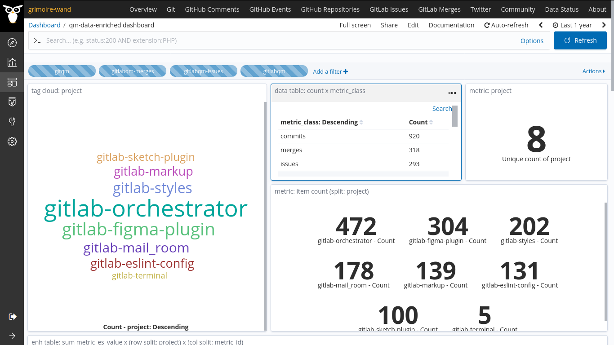

Hello 

As we reached the end of the first coding period, I am writing this blog post to highlight the work done during this period. 🚴

I focused on working with the enrichers whose output should be easily consumed by Prosoul. It involves framing the right structure of the index data format, planning the metrics which can be extracted from the data sources, and writing the enrichers which convert the raw data to enriched items. These enriched items should be able to be fed to Prosoul to perform assessments and generate reports.

- The first and important step was to frame the right index format for each item. 🤔 
	
	For this, I initially went through the existing scava-metrics index that I used in the [microtask-9](https://github.com/vchrombie/chaoss-microtasks/tree/master/microtask-9) during the application period. I got a sample of how an item should look. I discussed with Valerio and changed (removed & added a few items) the structure as needed. [vchrombie/gsoc#7](https://github.com/vchrombie/gsoc/issues/7)
    ```
    {
      "project": "cms" ,    <---
      "metric_class": "issues" ,    <---
      "metric_type": "LineChart" ,    <---
      "metric_id": "issues.numberOpenIssues" ,    <---
      "metric_desc": "The number of issues opened on a current date.",    <---
      "metric_name": "Number of Open Issues" ,    <---
      "metric_es_value": 8 ,    <---
      "metric_es_compute": "sample" ,
      "datetime": "2020-01-01T00:00:00+00:00" ,    <---
      "uuid": "2fb8da7299fa849c8cda9dc5f9c571493fa67234" ,    <---
      "metric_es_value_weighted": 8 ,    <---
      "meta": {
        "top_projects": [
          "main"
        ]
      }
    }
    ```
- Before starting to work on the enricher, I need the metrics which can be extracted from the raw data. I started working on _gitlabqm_ as I was familiar with it. [vchrombie/gsoc#8](https://github.com/vchrombie/gsoc/issues/8)

- After planning an initial set of metrics, I started working with the _gitlabqm_ enricher. The approach for the enrichers is
    1. Filter all the issues items and build a dictionary with dates and keys and the number of issues (metric data items) as values.
    2. Add the items to make the dictionary enricher item and upload it to es.

- After many iteration and experiments, the enricher was finally done and was able to extract the items and upload them to the index. [vchrombie/gsoc#6](https://github.com/vchrombie/gsoc/issues/6)
    ```
    {
      "metric_es_compute": "sample",
      "metric_type": "LineChart",
      "metric_class": "issues",
      "metric_id": "issues.numberCreatedIssues",
      "metric_desc": "The number of issues created on a current date.",
      "metric_name": "Number of Created Issues",
      "project": "cms-mobile",
      "datetime": "2020-05-14T00:00:00+00:00",
      "metric_es_value": 2,
      "metric_es_value_weighted": 2,
      "uuid": "75a79aa09cff301c5f7191188e5a1385c9dc87aa",
      "id": "created_issue_75a79aa09cff301c5f7191188e5a1385c9dc87aa",
      "grimoire_creation_date": "2020-05-14T00:00:00+00:00",
      "is_gitlabqm_date": 1
    }
    ```


PRs 👉 [chaoss/grimoirelab-elk#902](https://github.com/chaoss/grimoirelab-elk/pull/902), [chaoss/grimoirelab-elk#892](https://github.com/chaoss/grimoirelab-elk/pull/892)

- Later we defined more metrics, for both gitlab ([vchrombie/gsoc#8](https://github.com/vchrombie/gsoc/issues/8)) and git ([vchrombie/gsoc#9](https://github.com/vchrombie/gsoc/issues/9)) raw data. I worked on implementing enrichers to extract the data items for the following metrics.
    - _gitlabqm_: numberCreatedIssues, numberClosedIssues, numberCreatedMerges, numberClosedMerges, numberMergedMerges, numberIssueComments, numberMergeComments
    - _gitqm_: numberCommitsCreated, numberLinesAdded, numberLinesRemoved, numberActions, numberFilesChanged

- I worked on making a dashboard to have a better understanding of the enriched data. After multiple iterations, I've made a common dashboard for all the enrichers and added filters to manage the results. [vchrombie/gsoc#5 (comment)](https://github.com/vchrombie/gsoc/issues/5#issuecomment-650801826)


- Now that we have two enrichers working, I've decided to play with Prosoul using the extracted metrics data. I've executed the raw and enrich tasks using micro-mordred and completed enriching items of around eight projects of [GitLab.org](https://gitlab.com/gitlab-org). I have used the [Developer QM](https://github.com/Bitergia/prosoul/blob/master/django-prosoul/prosoul/data/developer_model.json) to perform an assessment. The results were better. 👌


Some more results, [vchrombie/gsoc#5 (comment)](https://github.com/vchrombie/gsoc/issues/5#issuecomment-650801828).

I have written reports sharing the weekly work in my blog. You can have a look. 👀
1. [semana uno](https://github.com/vchrombie/gsoc/tree/master/work/week-01#semana-uno)
2. [semana dos](https://github.com/vchrombie/gsoc/tree/master/work/week-02#semana-dos)
3. [semana tres](https://github.com/vchrombie/gsoc/tree/master/work/week-03#semana-tres)
4. [semana cuatro](https://github.com/vchrombie/gsoc/tree/master/work/week-04#semana-cuatro)

Gearing up for the second coding period. 🏄

If you have any comments or questions, please make sure to comment down below. :)
