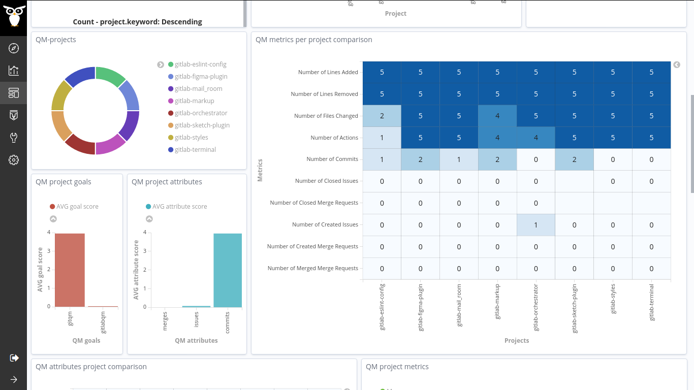
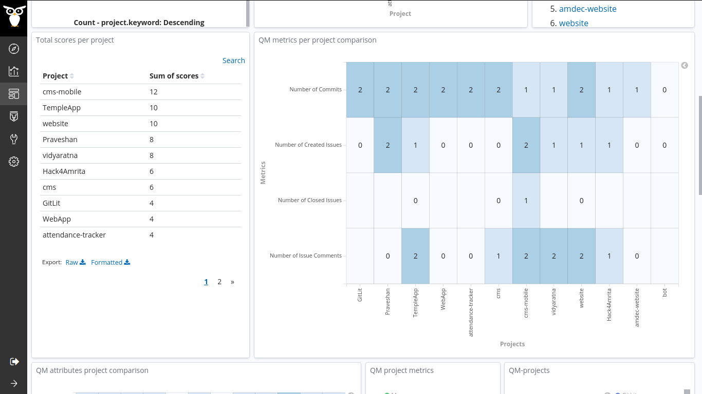

Hello 

As we reached the end of the second coding period, I am writing this blog post to highlight the work done during this period. 🏄

- In the initial weeks, I was concentrating on making the Prosoul results dashboard. There was an existing dashboard related to the Quality Models in the crossminer project, [scava-qm dashboard](http://crossminer.bitergia.net/app/kibana#/dashboard/72ac14b0-456e-11e9-a208-9748f08b9341). I took this as a reference ✊, and I replicated the visualizations with the current results obtained. [vchrombie/gsoc#12 (comment)](https://github.com/vchrombie/gsoc/issues/12#issuecomment-654420431)

- We found the possibility to add two additional metrics to the _gitlabqm_ enricher, the number of issues attended and the number of merge requests attended. I have worked on it and completed implementing the extra metrics too. [vchrombie/gsoc#8](https://github.com/vchrombie/gsoc/issues/8)

- Next, I have performed a study on the [amFOSS](https://amfoss.in/) projects as I'm a bit familiar with the projects and I have an understanding of their growth. I used two data sources gitlab and git (qm enrichers) for 10 projects and the Developer Quality Model, which has 2 goals and 4 metrics. [vchrombie/gsoc#13](https://github.com/vchrombie/gsoc/issues/13)

You can check more results from here, [vchrombie/gsoc#13 (comment)](https://github.com/vchrombie/gsoc/issues/13#issuecomment-656187839)

- Later, we started working towards adding a few more data sources to the list. We have discussed the metrics for _pipermailqm_ [vchrombie/gsoc#11](https://github.com/vchrombie/gsoc/issues/11) and _meetupqm_ [vchrombie/gsoc#14](https://github.com/vchrombie/gsoc/issues/14). I have worked on it for a few days and completed implementing all the planned metrics.

- The next target was to add tests to the existing enrichers. I had some pretty good experience working with tests as I have tried it on the gitlabcomments enricher during the Community Bonding Period. I took some inspiration from the implementation of tests and started working.

I have written reports sharing the weekly work in my blog. You can have a look. 👀
1. [semana cinco](https://github.com/vchrombie/gsoc/tree/master/work/week-05#semana-cinco)
2. [semana seis](https://github.com/vchrombie/gsoc/tree/master/work/week-06#semana-seis)
3. [semana siete](https://github.com/vchrombie/gsoc/tree/master/work/week-07#semana-siete)
4. [semana ocho](https://github.com/vchrombie/gsoc/tree/master/work/week-08#semana-ocho)

Gearing up for the final coding period. 🪂

If you have any comments or questions, please make sure to comment down below. :)
