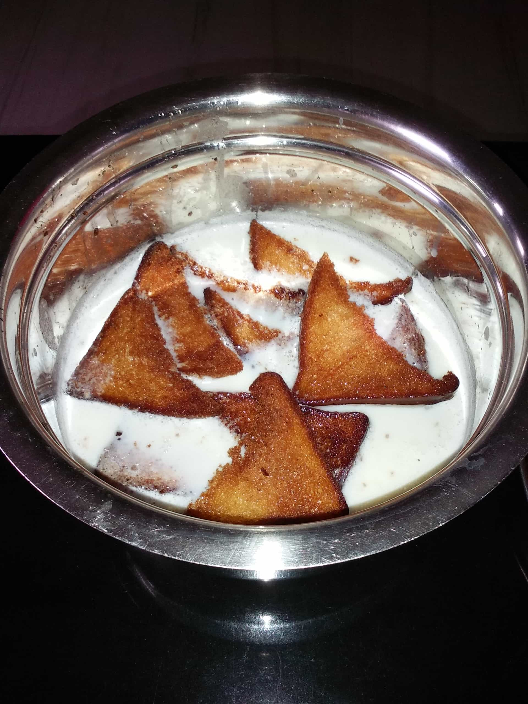

Hello Everyone,

So, I am back with one more interesting but different post. Till now I was tinkering around the technical or motivational posts,but for a change I will be posting cooking blog posts too. I started learning cooking as it is one of the basic things one need to know. Enlightenment by Vipin Sir. After all, what these studies, coding, money is for? For food right. Ya, you got the point too. So, let's get started.

Double ka meetha is a bread pudding Indian sweet of fried bread slices soaked in hot milk with spices, including saffron and cardamom. It is popular in Hyderabadi cuisine, served at weddings and parties. Double ka meetha refers to the milk bread, called "Double Roti" in the local Indian dialects because it swells up to almost double its original size after baking.

### Ingredients:

- 1 uncut bread loaf
- 1 cup - khoya
- 1/2 cup - Sugar
- 1/2 litre - Milk
- Dry fruits sliced ( kaju, kismis, badam, karboja seeds)
- Dalda for frying bread
- 3 tsp - Ghee for frying dry fruits
- 2 Cardamom

### Steps

1. Boil milk in a bowl on low heat, now mash the khoya and add it to the milk till the milk becomes thick.

    

2. Cut bread into cubes or triangles (whatever shape you want).

    

3.  Deep fry them in dalda or refined oil according to your choice.

    

3. Drain on tissue paper and place on a tray-like vessel and keep aside.

    

4. Heat a kadai, add ghee and all dry fruits to it and fry. Add fried dry fruits to fried bread along with ghee.

5. Once the milk turns into a thick mixture, add a pinch of saffron and cardamom and mix well. Add the ghee dry fruit mixture too.

    

6. Remove from heat and add the bread and mix well.

    

7. Let the mixture soak with bread for 30 min max.

    

8. Once it is soaked well, serve it as a dessert. You can eat it after cooling it also.

    

Tadaa, and the special Hyderabadi Double Ka Meetha is ready now. You can have it when it is hot and it also tastes super good after cooling. You can lick the bowl too as I did. 😋

Mandatory pic (me as chef) of mine as a proof. 😃

I will see you soon with another blog post in "The Chef In Me" series. Bubye! :)
