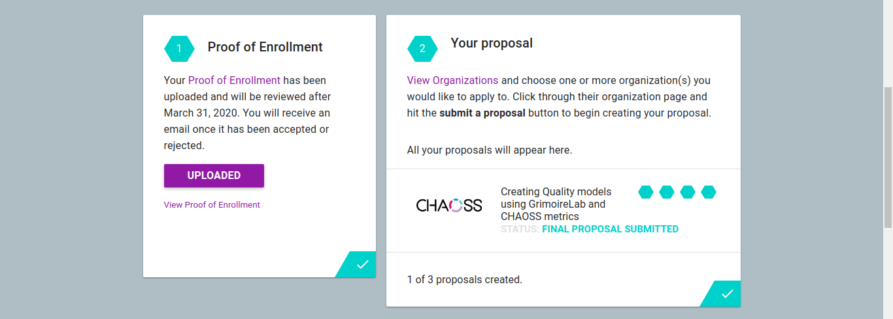
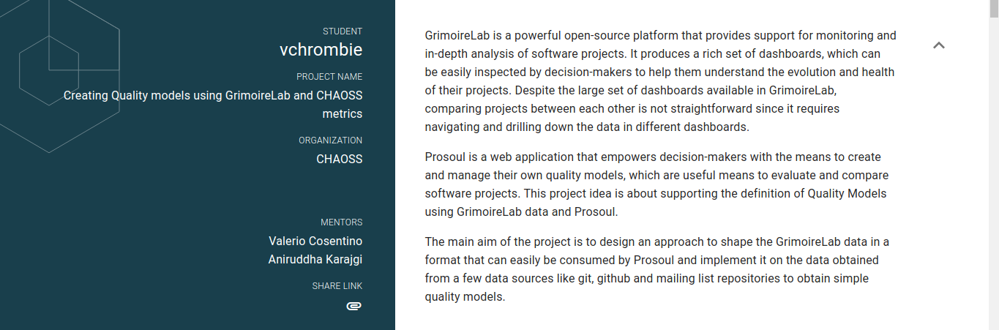

Hola!

> Hi vchrombie,
>
> Your proposal Creating Quality models using GrimoireLab and CHAOSS metrics has been accepted!
>
> Welcome to GSoC 2020!
>
> We look forward to seeing the great things you will accomplish this summer with CHAOSS.

Yes, I got selected for the Google Summer of Code 2020 program. 🥳

The first time I heard about this program was during my first year. Later, I tried applying in my second and third year but I couldn't make it through. This is my final year and was probably my last chance to apply. I didn't take it easy this time. I collected the feedback and analyzed the mistakes I did in the previous years. I started off early, contributing and preparing a proposal for the project.

It has been more than a year since I was involved with CHAOSS. I applied last year too but I didn't get selected. But, I didn't stop involving with the community. I sticked around, contributing to their projects and participating with the community activities. This time, I decided to go with the same organization as I saw some pretty good ideas in the list. I selected an idea, Creating Quality models using GrimoireLab and CHAOSS metrics ([chaoss/grimoirelab#287](https://github.com/chaoss/grimoirelab/issues/287)).

I was already kinda familiar with the procedure of CHAOSS. The applicants are expected to work on the microtasks, parallely making some good initial contributions and working on the proposal. The mentors are always helpful to get you started with the contributions and helping & reviewing the microtasks. I started doing the microtasks by the first week of February, doing some contributions along the way. Link to the microtasks repository, [vchrombie/chaoss-microtasks](https://github.com/vchrombie/chaoss-microtasks).

There were a lot of improvements to the GrimoireLab during the application period. Some of the main contributions in which I was involved are
- Made a script to automate some part of the dev env setup of GrimoireLab, [glab-dev-env-setup.py](https://gist.github.com/vchrombie/4403193198cd79e7ee0079259311f6e8).
- Made a video on how to setup Prosoul, [Setting up Prosoul | YouTube](https://www.youtube.com/watch?v=-wU1ck4ZrUw).
- Involved with a major revamp of [Getting Started Tutorial](https://github.com/chaoss/grimoirelab-sirmordred/blob/master/Getting-Started.md) of the SirMordred tool.
- Improvements and bug fixes in Prosoul, [contributions](https://github.com/Bitergia/prosoul/pulls?q=is%3Apr+author%3Avchrombie).
- Made a tool to update the licenses of the code files in the repository, ([vchrombie/reparo](https://github.com/vchrombie/reparo)). Tested it on a few huge repositories like perceval and graal.

You can find all the contributions here, [vchrombie/chaoss-microtasks#10](https://github.com/vchrombie/chaoss-microtasks/blob/master/microtask-10/README.md). 

The next step was the proposal. [Valerio](http://valeriocos.github.io/) helped a lot with the understanding of the project idea. I had a pretty good understanding of the project as he cleared most of the doubts. You can go through my proposal, 
[gsoc-proposal-venu.pdf](https://github.com/vchrombie/gsoc/blob/master/notes/gsoc-proposal-venu.pdf).

After submitting the application, I was just waiting with my fingers crossed. 🤞

Meanwhile, I proposed the participation of CHAOSS in the Google Summer of Docs 2020 program. We managed to get a chance to apply on behalf of the Linux Foundation and we collected a total of 5 ideas for the program, [gsod-2020-chaoss-ideas](https://wiki.linuxfoundation.org/gsoc/2020-gsod-chaoss).

The results day, May 4th has arrived. I got selected with eight other GSoC students from CHAOSS and one Outreachy student. I was happy about it. There are two students from the GrimoireLab project, one being me and the other one was [Ria Gupta](https://github.com/ria18405). Ria will be working on another idea, Implement the Social Currency Metrics System in GrimoireLab ([chaoss/grimoirelab#288](https://github.com/chaoss/grimoirelab/issues/288)).

The idea of the project is to create simple software quality models using Prosoul, the GrimoireLab data and the CHAOSS metrics. You can read more about the project from here, [projects/#5489558193438720 | GSoC](https://summerofcode.withgoogle.com/projects/#5489558193438720).

<blockquote class="twitter-tweet tw-align-center">
I&#39;ll be working with <a href="https://twitter.com/CHAOSSproj?ref_src=twsrc%5Etfw">@CHAOSSproj</a> during this summer as a part of <a href="https://twitter.com/gsoc?ref_src=twsrc%5Etfw">@gsoc</a>. I was selected to work on the project to create simple software quality models using Prosoul, the <a href="https://twitter.com/GrimoireLab?ref_src=twsrc%5Etfw">@GrimoireLab</a> data and the CHAOSS metrics.<a href="https://twitter.com/Bitergia?ref_src=twsrc%5Etfw">@Bitergia</a> <a href="https://twitter.com/amfoss_in?ref_src=twsrc%5Etfw">@amfoss_in</a> <a href="https://twitter.com/AMRITAedu?ref_src=twsrc%5Etfw">@AMRITAedu</a>Link 👉 <a href="https://t.co/tZ8RHQ49GE">https://t.co/tZ8RHQ49GE</a> <a href="https://t.co/X9BU0bBIqS">pic.twitter.com/X9BU0bBIqS</a>
&mdash; Venu Vardhan Reddy Tekula (@vchrombie) <a href="https://twitter.com/vchrombie/status/1259804123345547264?ref_src=twsrc%5Etfw">May 11, 2020</a></blockquote>

> "Everything will be okay in the end. If it's not okay, it's not the end." \- John Lennon

Cheers to another fantastic summer coming up next. 😃