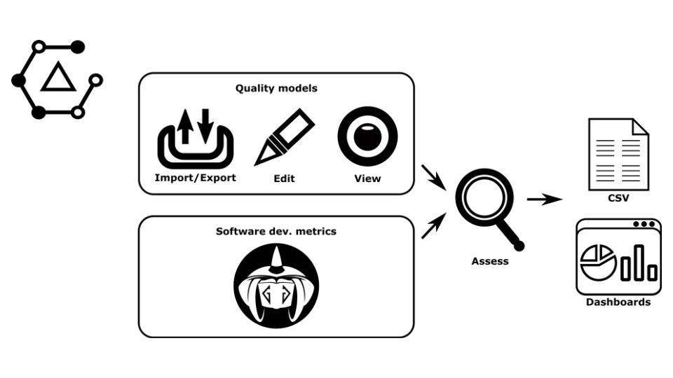
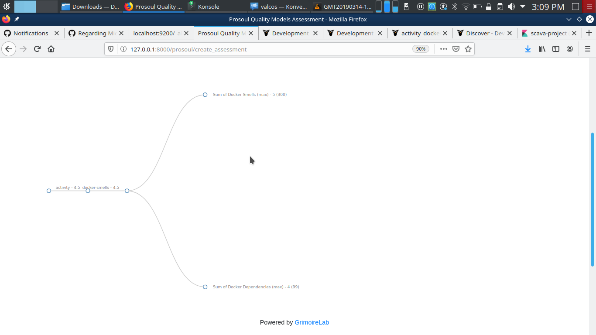
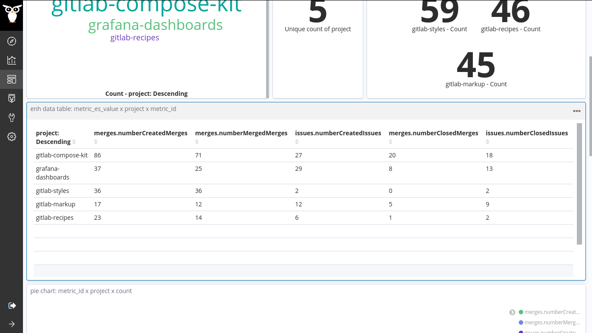
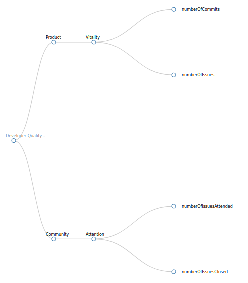
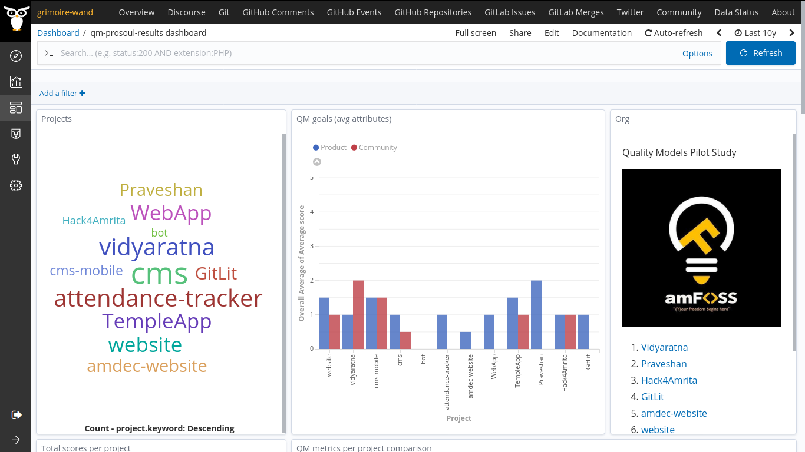
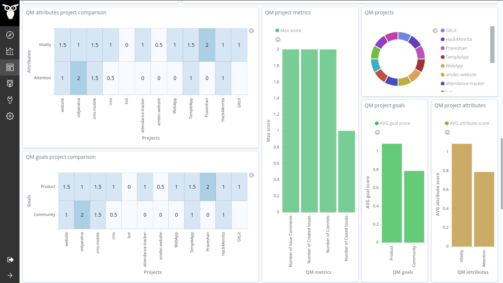
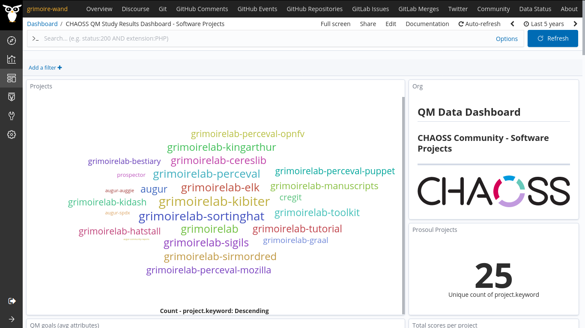
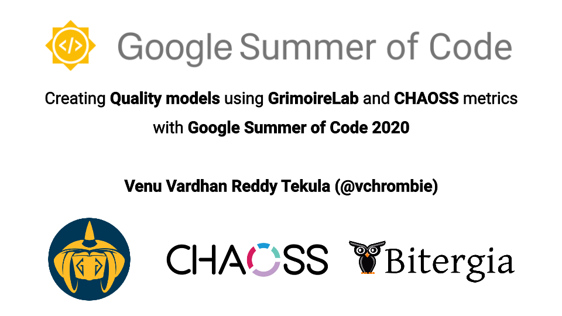

#### Final Report | vchrombie | CHAOSS | GSoC 2020 ☀️

In this post, I will be summarizing the work which was done during all the coding periods of the Google Summer of Code 2020 program along with the results and future work. This post would also serve as the final report for the project and contains the information of all my contributions during the program.

##### Basic Information

- Name: Venu Vardhan Reddy Tekula
- Project: [Creating Quality models with GrimoireLab and CHAOSS metrics](https://summerofcode.withgoogle.com/archive/2020/projects/6524989651550208/)
- Mentors: Valerio Cosentino, Aniruddha Karajgi, David Moreno-Lumbreras, Nishchith Shetty
- Organization: [CHAOSS](https://chaoss.community/)
- University: Amrita Vishwa Vidyapeetham, Amritapuri.
- GitHub: [github.com/vchrombie](https://github.com/vchrombie)
- Twitter: [@vchrombie](https://twitter.com/vchrombie)
- Blog: [vchrombie.github.io/blog](https://vchrombie.github.io/blog/)
- Project Tracker: [github.com/vchrombie/gsoc](https://github.com/vchrombie/gsoc)

##### Little Background

It has been more than a year since I was involved with CHAOSS. I applied for GSoC last year too, but I didn't get selected. I continued contributing to the organization even after that. I was in my Bachelor’s final year and was probably the last chance to apply for the program. I decided to stick to the same org and started working early.

The mentors (Valerio) were supportive during the application period, and I submitted the proposal for the [QM idea (287)](https://github.com/chaoss/grimoirelab/issues/287). It was on May 4, the results were out, and I got selected for the project. I prepared myself for an exciting summer ahead.

You can read more about it here, [aceptación gsoc](https://vchrombie.github.io/blog/gsoc-acceptance).

##### About the Project

**GrimoireLab** is a powerful open-source platform that provides support for monitoring and in-depth analysis of software projects. It produces a rich set of dashboards, which can be easily inspected by decision-makers to help them understand the evolution and health of their projects. Despite the large set of dashboards available in GrimoireLab, comparing projects between each other is not straightforward since it requires navigating and drilling down the data in different dashboards.

On the other hand, **Quality Models** are well-known tools useful to evaluate a project, since they allow decision-makers to understand its status without diving into low-level details. Nevertheless, due to the lack of tooling and missing properties not covered by the standard quality models, operationalizing a quality model and applying it to a specific scenario may turn into a difficult experience.

**Prosoul** is an open-source tool that lets users create, manage, and visualize their quality models, operationalizing the latter with software metrics coming from a set of target projects. Prosoul's quality model is composed of coarse-level goals (e.g., sustainability), each one defined as a set of fine-grained attributes (e.g., activity, community), which can be derived from one or more low-level metrics (e.g., number of commits, number of active users).

The main aim of the project is to design an approach to shape the GrimoireLab data in a format that can easily be consumed by Prosoul and implement it on the data obtained from a few data sources like git, github and mailing list repositories to obtain simple quality models.

##### Architecture of the Project

##### Terminology

- **Elasticsearch**: It is a highly scalable open-source full-text search and analytics engine. It allows you to store, search, and analyze big volumes of data quickly and in near real-time. It stores the data as JSON documents.
- **Kibiter**: Kibiter is a soft-fork of **Kibana**, which is an open-source analytics and visualization platform based on Elasticsearch. You can use Kibana to explore your Elasticsearch data and then build beautiful visualizations and dashboards.
- **Index** (plural form is indexes/indices): An optimized collection of JSON documents. Each document is a collection of fields, the key-value pairs that contain your data. [Link](https://www.elastic.co/guide/en/elasticsearch/reference/current/glossary.html#index)
- **Enrichers**: Enrichers are scripts which enrich the raw Perceval (extracts the useful data) and stores it in the Elasticsearch as indexes.
- **Pilot Study**: It is progressive testing of the approach on the projects of an organization to estimate the results. 
- **Assessment**: It is an evaluation of the projects using a quality model.

##### Completed Work

1. Worked on five enrichers (related to quality models) and integrated them with the GrimoireLab toolchain. The enrichers are planned as per the popular datasources.
	- gitlabqm
	- gitqm
	- pipermailqm
	- meetupqm
	- githubqm
2. Made the results dashboards to visualize the assessment results. I made another dashboard to analyze the enriched data. Some of the dashboards were derived from the CROSSMINER project.
3. Worked on adding the initial tests for the enrichers.
4. Performed three pilot studies on different organizations (amFOSS, GitLab.org, CHAOSS). The main reason behind these pilot studies is to test the approach on various projects with different sizes.
5. Improved the documentation of Prosoul, also updated the workflow for the integration of Prosoul with GrimoireLab.

##### Coding Period I

Before the starting of the project, I didn’t have much understanding of how Prosoul works. I had a good experience of working with the GrimoireLab and its components. So, I spent some time learning how Prosoul performs the assessments based on the quality models and the CROSSMINER data.

I have to design the structure of the data that can be easily consumed by Prosoul without much change in its architecture. I took the reference of the CROSSMINER data that was supported by Prosoul and came up with an initial format of the data that refined over time.

I worked on GrimoireLab-ELK and created a few enrichers (gitqm and few metrics in gitlabqm) that can generate the enriched data from the raw data according to the format that was required. I integrated them with the toolchain.

")

I have performed a few test assessments using the enriched data and demo quality models created using the implemented metrics. I worked on making a dashboard to have a better understanding of the enriched data. The dashboard shows different visualizations of the enriched data.

**PRs**
- [chaoss/grimoirelab-elk#892](https://github.com/chaoss/grimoirelab-elk/pull/892): [qm-elk] Add support for QM data enrichment
- [chaoss/grimoirelab-elk#902](https://github.com/chaoss/grimoirelab-elk/pull/902): [qm-elk] Add support for QM data enrichment
- [chaoss/grimoirelab-sirmordred#476](https://github.com/chaoss/grimoirelab-sirmordred/pull/476): [docs] Update Getting-Started.md result image

**Issues**
- [vchrombie/gsoc#5](https://github.com/vchrombie/gsoc/issues/5): [tasks] periodo de codificación 1
- [vchrombie/gsoc#6](https://github.com/vchrombie/gsoc/issues/6): [enricher] Implement QM Enrichers
- [vchrombie/gsoc#7](https://github.com/vchrombie/gsoc/issues/7): [es-index] plan the structure for index data
- [vchrombie/gsoc#8](https://github.com/vchrombie/gsoc/issues/8): [metrics] gitlab raw data
- [vchrombie/gsoc#9](https://github.com/vchrombie/gsoc/issues/9): [metrics] git raw data

##### Coding Period II

I made the results dashboard. The assessment results are stored as indexes. I took inspiration from the existing CROSSMINER dashboard and built a dashboard on top of that. The dashboard has bar and heat map visualizations. I have performed the first pilot study on the projects of amFOSS that includes two data sources, git & gitlab, and used the Developer Quality Model for the pilot study.

We discussed the metrics of the enrichers, and I completed implementing them in the respective enrichers. (gitlabqm, pipermailqm, and meetup). I worked on adding tests to the existing enrichers.

**PRs**
- [chaoss/grimoirelab-elk#926](https://github.com/chaoss/grimoirelab-elk/pull/926): [qm-elk] Add support for QM data enrichment

**Issues**
- [vchrombie/gsoc#12](https://github.com/vchrombie/gsoc/issues/12): [tasks] periodo de codificación 2
- [vchrombie/gsoc#6](https://github.com/vchrombie/gsoc/issues/6): [enricher] Implement QM Enrichers
- [vchrombie/gsoc#8](https://github.com/vchrombie/gsoc/issues/8): [metrics] gitlab raw data
- [vchrombie/gsoc#11](https://github.com/vchrombie/gsoc/issues/11): [metrics] pipermail raw data
- [vchrombie/gsoc#13](https://github.com/vchrombie/gsoc/issues/13): [assessments] perform assessments on various projects of different organizations
- [vchrombie/gsoc#14](https://github.com/vchrombie/gsoc/issues/14): [metrics] meetup raw data
- [vchrombie/gsoc#15](https://github.com/vchrombie/gsoc/issues/15): Implement tests for the enrichers

##### Coding Period III

We decided to perform the second pilot study on GitLab.org that involves the gitlab & meetup data sources and customized Developer Quality Model. As the projects were not related, I had to perform two separate studies.

")

After the study, we found a few implementation flaws in the enrichers while handling large repositories. I spent some time debugging the issues and fixed them.

We checked the results of the pilot study and evaluated the usage of the existing visualizations. We decided to remove the project pie chart visualization.

")

")

")

We planned to add support for another data source, github. It would have the same metrics as that for gitlab. So, I worked on the githubqm enricher and implemented all the metrics.

As the github enricher is now ready, we planned for a third pilot study on the CHAOSS software projects. The involved data sources are git & github and used the Developer Quality Model.

")

There is a characteristic called threshold for each metric, which allocates the score to the project. I analyzed the data range for each metric and used a specific threshold for each metric.

")

From this study, we found a limitation to the approach. The results may not be accurate with the work done on the forked projects. Kibiter is a soft-fork of the Kibana project, so it had the commits from the upstream project too. In this case, the evaluation of the actual work done on the Kibiter can differ.

Towards the end, I worked on adding the documentation of the project. One correct place was the Prosoul repository and also the qm folder in the GrimoireLab-ELK. I revamped the Prosoul with GrimoireLab doc and updated it with the latest workflow of the project.

**PRs**
- [Bitergia/prosoul#216](https://github.com/Bitergia/prosoul/pull/216): [doc] Update prosoul-grimoirelab.md
- [Bitergia/prosoul#215](https://github.com/Bitergia/prosoul/pull/215): [docker] Update docker-compose.yml
- [Bitergia/prosoul#213](https://github.com/Bitergia/prosoul/pull/213): [doc] Update the repo with the latest images
- [chaoss/grimoirelab-sirmordred#486](https://github.com/chaoss/grimoirelab-sirmordred/pull/486): [doc] Add instructions for QM Enrichers
- [chaoss/grimoirelab-sigils#470](https://github.com/chaoss/grimoirelab-sigils/pull/470): [qm] Add qm dashboard
- [chaoss/grimoirelab-sigils#469](https://github.com/chaoss/grimoirelab-sigils/pull/469): Update documentation about Kidash

**Issues**
- [Bitergia/prosoul#214](https://github.com/Bitergia/prosoul/issues/214): [docker] docker-compose file seems outdated
- [vchrombie/gsoc#17](https://github.com/vchrombie/gsoc/issues/17): [tasks] periodo de codificación 3 
- [vchrombie/gsoc#13](https://github.com/vchrombie/gsoc/issues/13): [assessments] perform assessments on various projects of different organizations 
- [vchrombie/gsoc#19](https://github.com/vchrombie/gsoc/issues/19): [metrics] github raw data
- [vchrombie/gsoc#6](https://github.com/vchrombie/gsoc/issues/6): [enricher] Implement QM Enrichers
- [vchrombie/gsoc#20](https://github.com/vchrombie/gsoc/issues/20): Project Documentation

##### Work Demo Video

**Click on the image for the video 🖱️**

##### Limitations

1. The results may not be accurate with the work done on the forked projects.
2. Few projects might not use the issue tracker (in case of gitlab and github data source). The projects need to be analyzed before the study and evaluate what metrics and data sources would be relevant for the assessment.

##### Future Work

1. The tests for the enrichers and the documentation for the dashboard.
2. Tutorials for ‘How to use Prosoul’.
3. An in-depth analysis of the assessment results can be performed. The heat map visualizations data can be exported to CSV and a non-supervised classification (k-means algorithm) can be applied to look for clusters of similar projects. This might be a good way to present the results.
4. Right now, individual projects are compared, and the results are generated. But, the projects can be grouped under the master projects (eg. grimoirelab-tools and augur-related). Presenting the results at this level would be more useful to compare the activity.
5. A workflow or process to analyze the projects and evaluate which metrics and data sources are relevant for the assessment.

##### Things learned

- Working with a large codebase.
- Study the workflow of the projects.
- Communicating effectively remotely with different time zones.
- Writing clean & effective code and adding tests.
- Late night work causes burnout. 😪
- Technically: GrimoireLab toolchain (ELK, Kibiter), ELK-stack (mainly creating dashboards), Django, and a lot more...

Even after GSoC ends, I look forward to continuing to work with the community and contribute to GrimoireLab.

##### Owe my biggest thanks to

- The project mentors (Valerio Cosentino, Aniruddha Karajgi, David Moreno Lumbreras, Nishchith Shetty) for suggesting improvements, discussing and clarifying my doubts related to the project.
- CHAOSS Community for being supportive throughout the program and encouraging discussions in the mailing lists and community calls.
- Vipin Pavithran Sir and the [amFOSS](https://amfoss.in/) for continuous guidance and help.
- frds and fam ❤️

##### Footnotes

I created a project tracker, [vchrombie/gsoc](https://github.com/vchrombie/gsoc) for storing the information about the project. We had a meeting every Thursday at the `#grimoirelab` channel on Freenode IRC. You can find the meeting logs in the [meetings](https://github.com/vchrombie/gsoc/blob/master/meetings) directory. You can find the weekly work reports in the [work](https://github.com/vchrombie/gsoc/blob/master/work) directory. All the discussions happened using the GitHub [issues](https://github.com/vchrombie/gsoc/issues?q=is%3Aissue), and I used the [project board](https://github.com/vchrombie/gsoc/projects/1) to track the progress of the work.

You can check out all my weekly blog updates on my blog, [GSoC related posts](https://vchrombie.github.io/blog/tags/g-so-c).

Please feel free to comment below if you have any opinions/suggestions. :)
