Hello peeps! Well, I have attended the first ever Hackathon of my life. So, I would like to tell about my experience of it right from our journey to the hack we made in the short span of 1440 minutes.

### Hack Ideas
I decided to go with [Aswin](https://twitter.com/aswinshenoy_) and [Akhil](https://twitter.com/akhilam513) and then we registered and started brainstorming about the proposal. We are going no where as we are not clear **problem**. We started looking for problems. Back in my fresher days, being a newbie in OSS, I was not sure to which repositories to contribute. Whenever I search for repos, I get suggestions as [tensorflow/tensorflow](https://github.com/tensorflow/tensorflow) or [facebook/Docusaurus](https://github.com/facebook/Docusaurus).

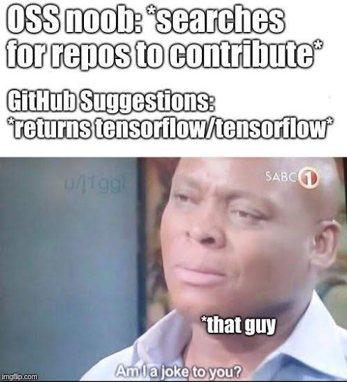

Well, we decided to fix this problem. Our solution was to create a new search which GitHub doesn't have called "repos which suits you most..". We can't integrate into GitHub, as it is not Open Source. So, we decided to make our own web app. We wrote a proposal and got selected. ✌️

We reached Bangalore on December 14th and stayed in the Amrita Bangalore Campus, roaming in the nights and having good food. :) 

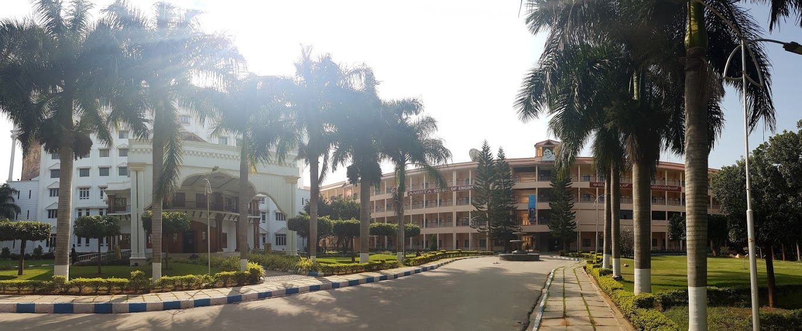

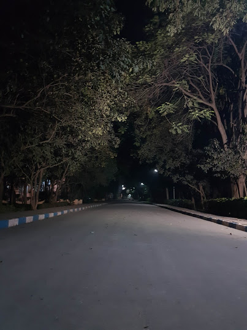

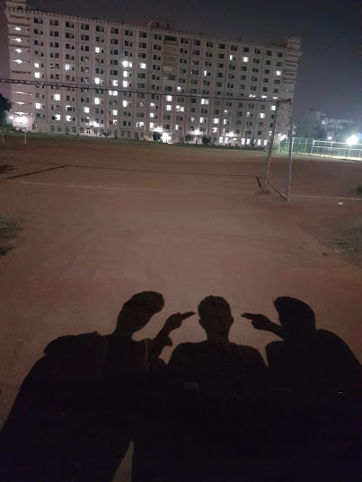

### DevRelConf
There was a conference too right before the hackathon which mainly concentrated on "Developer Relations". We met people from various communities and fields. We had talks from various speakers like [Karthik Padmanabhan](http://www.linkedin.com/in/karthikp) and [Julia Aslamova](https://www.linkedin.com/in/yulialund/). I had nice time meeting and talking with people like [Subhendu Panigrahi](https://twitter.com/skipiit), CEO of Skillenza. Most of the talks were revolving around the word, *community*. 

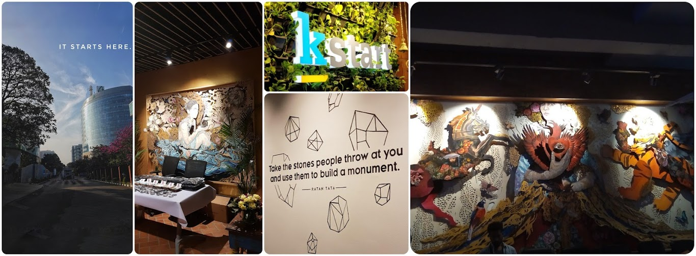

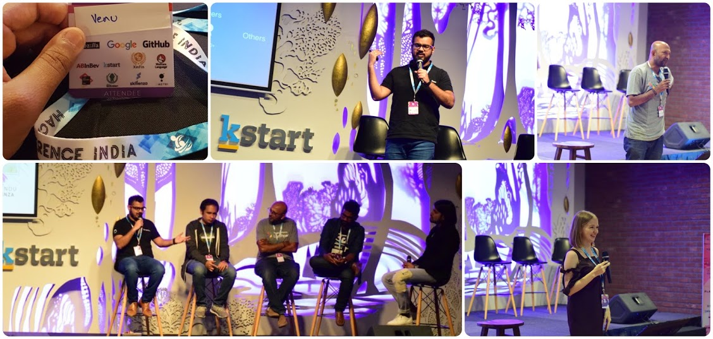

### Hackathon
We were given 20 hours for working on our idea. Initially we made few conclusions of our idea and then started working parallely updating our work in Twitter. We divided the work into three parts, Ashwin will work on the frontend and the django app. Akhil will work on the backend, making and coding the algorithms and I will be working on the final matching and ML part. We were helping each other when anyone needs help and support. Well, that is what I call *team-work*.

<blockquote class="twitter-tweet tw-align-center">
Let The Hacking Begins!! ;)<a href="https://twitter.com/hashtag/HackferenceIndia?src=hash&amp;ref_src=twsrc%5Etfw">#HackferenceIndia</a><a href="https://twitter.com/hashtag/teamdeadlock?src=hash&amp;ref_src=twsrc%5Etfw">#teamdeadlock</a> <a href="https://t.co/QWjyw8Sfkb">https://t.co/QWjyw8Sfkb</a>
&mdash; Venu Vardhan Reddy Tekula (@vchrombie) <a href="https://twitter.com/vchrombie/status/1073936398514741248?ref_src=twsrc%5Etfw">December 15, 2018</a></blockquote>

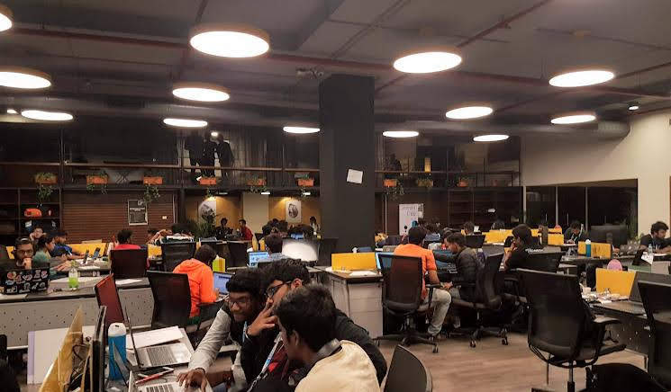

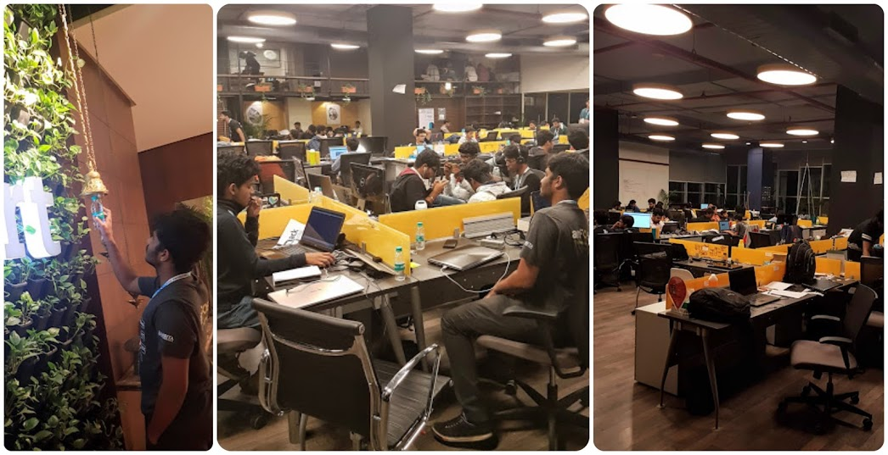

### Food and Sleep
We had lots of good food, ranging from early morning idly vada to mid midnight munchies. The cupcakes were the best at the event. We ate Google and GitHub cupcakes. 😋

We hardly slept at the event. Each of us took turns to sleep for just two hours and after we would start working again. I ended up sleeping for an hour or so on some chairs. It also gets fairly cold in the nights, and I wish I had brought a sweater or blanket or something. TBH, we were so active after that short nap and most of the bug fixing happened after the short nap. 

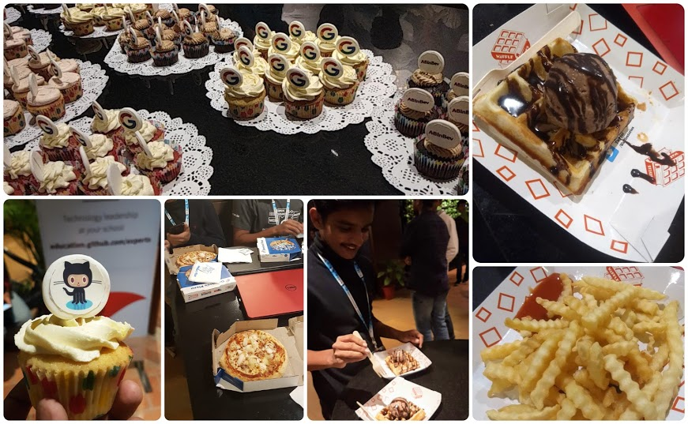

### Product!!
We made an app named GitLit. The concept is, the webapp matches user with repositories to which they can contribute. In detail, it calculates the score of the user keeping note of some metrics which are purely decided by us. Also, it calculates score of the repository too. Then we would suggest the users, whose score matches with the score of the repository, with the suitable repositories. Star the project, if you like it. :)

GitHub link: <https://github.com/teamdeadlock/gitlit>.

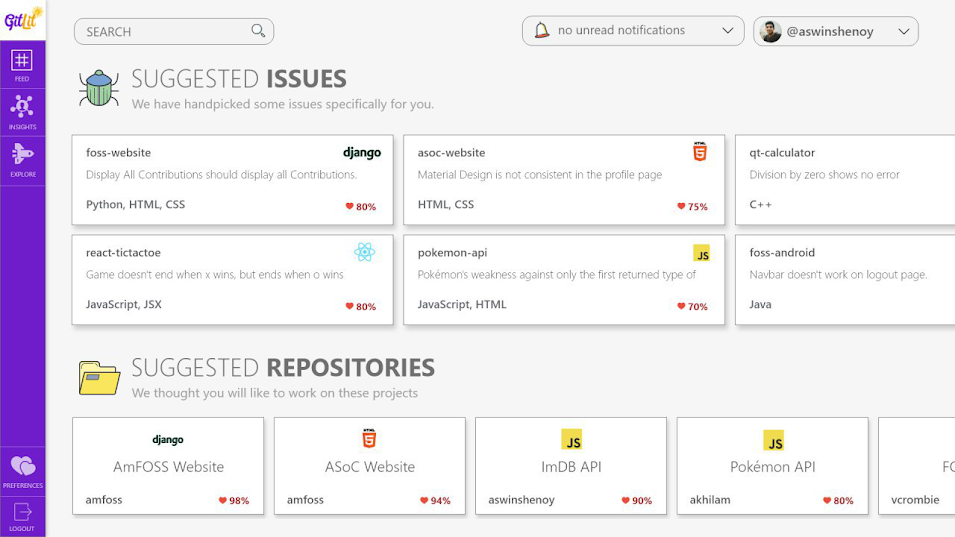

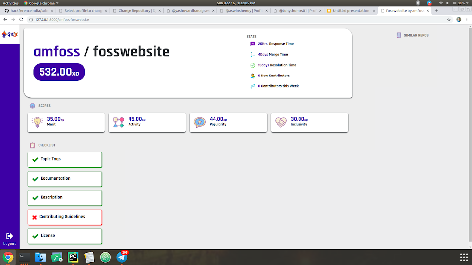

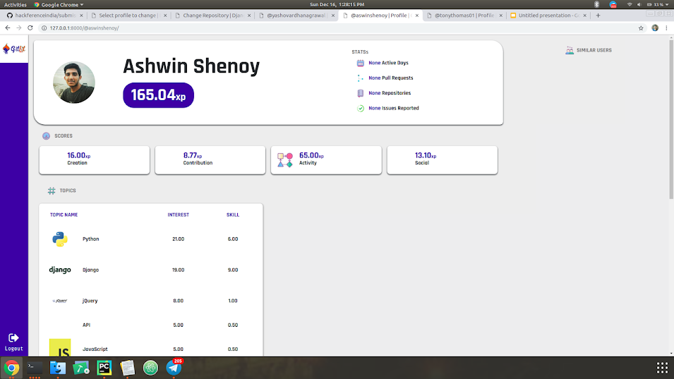

### All In All
It was really really fun attending this hackathon, I learned a lot, and I'm glad I decided to go! I already have signed up for two more this winter, and have a team together for the next one.

This winter is going to be an amazing experience of learning and having tons of fun. I am sure of it. 😀

<blockquote class="twitter-tweet tw-align-center">
&#39;GitLit&#39; is a web app to connect developers with projects, forming new communities. It works by rating users &amp; repos by a set of metrics &amp; then mapping them by ML looking at their skill level &amp; interests.<a href="https://t.co/Sy4vkapplI">https://t.co/Sy4vkapplI</a><a href="https://twitter.com/hashtag/TeamDeadlock?src=hash&amp;ref_src=twsrc%5Etfw">#TeamDeadlock</a><a href="https://twitter.com/vchrombie?ref_src=twsrc%5Etfw">@vchrombie</a> <a href="https://twitter.com/aswinshenoy_?ref_src=twsrc%5Etfw">@aswinshenoy_</a> @akhilam513 <a href="https://t.co/PwY0YhD1wL">pic.twitter.com/PwY0YhD1wL</a>
&mdash; FOSS@Amrita (@amfoss_in) <a href="https://twitter.com/amfoss_in/status/1074952522559717376?ref_src=twsrc%5Etfw">December 18, 2018</a></blockquote>