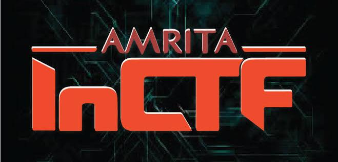
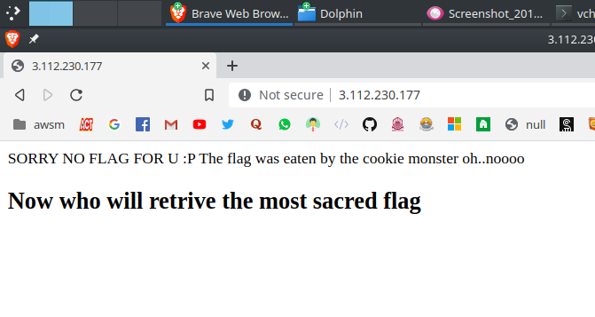
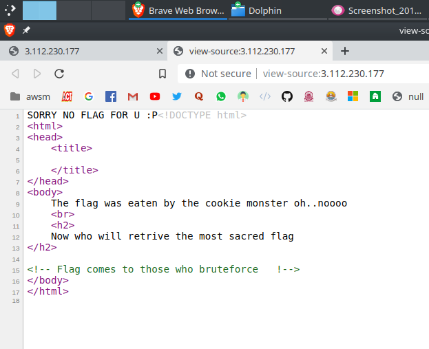

Hey peeps

After Vipin Sir's suggestion I decided to try something new. I planned to participate in the Amrita InCTF 2019. [Amrita InCTF](https://inctf.in) is the India’s First Ethical Hacking contest, Capture the Flag contest.



The process is simple, you need to register for it and need to participate in the Qualifier round. They would pick up the top 150 contestants who would appear for the finals at Amritapuri.

This was the first time I am trying something like this. So, this Qualifier round will be tough thing for sure. But, I decided to give it a try. Why not! I have a lot of time in my final year. 😛


## Online Qualifier Round: 09/11/2019 - 10/11/2019

The contest was for 36 hours and has challenges from Web, Forensics, pwn, RE and Crypto. I started with the Sanity checks flag submissions. 😄


### Web Exploitation

I have prior knowledge in Web Development. So, decided to give this a try at the starting of the contest.

```
Cookie's everywhere !!

Points: 100

Description: Can u spot the difference...

Challenge link - http://3.112.230.177/

Author : Captain-kay
```




The name and the source code gave me good idea that this is a cookie based challenge. I installed [EditThisCookie](https://chrome.google.com/webstore/detail/editthiscookie/fngmhnnpilhplaeedifhccceomclgfbg?hl=en) and started analyzing the cookies. Not much of use I thought. Then I did refresh and I found something fishy. The page changed and earlier there was only one cookie in use, `PHPSESSID` but later there was another cookie too, `_THE_FLAG_IS`. But that was the flag. C'mon this wont be so easy!

I knew cookies are stored as MD5 hash, tried to crack the cookie value using [HashBuster](https://github.com/s0md3v/Hash-Buster). I found something fishy but not really complete. 

```
vchrombie@gf ~/Desktop/InCTF/quals/web                [11:33:16] 
> $ python3 hash.py -s 13b5bfe96f3e2fe411c9f66f4a582adf         
_  _ ____ ____ _  _    ___  _  _ ____ ___ ____ ____
|__| |__| [__  |__|    |__] |  | [__   |  |___ |__/
|  | |  | ___] |  |    |__] |__| ___]  |  |___ |  \  v3.0

[!] Hash function : MD5
in
```

This was interesting, seems it to be a part of the flag. The flag format is `inctf{_}`. The unhashed cookie gave the first two letters of the flag. Then I did a refresh of the page again. Suprise! The cookie changed, a different value now. I used the same method above.

```
vchrombie@gf ~/Desktop/InCTF/quals/web                [11:33:44] 
> $ python3 hash.py -s 4fdeddb85f44ee6ef00c9c40c2c802fe         
_  _ ____ ____ _  _    ___  _  _ ____ ___ ____ ____
|__| |__| [__  |__|    |__] |  | [__   |  |___ |__/
|  | |  | ___] |  |    |__] |__| ___]  |  |___ |  \  v3.0

[!] Hash function : MD5
ct
```

Kitti! The next two words of the flag. I understood the scene. Started hunting down all the cookies. There were 15 hashes, in which the last hash is repeating later on. Wrote them into a file and cracked all the MD5 hashes altogether.

```
python3 hash.py -f hash.txt
```

And the results were interesting.

```
13b5bfe96f3e2fe411c9f66f4a582adf : in
afc32308426e771f1ad98b5790b91c77 : 1p
ab6c040066603ef2519d512b21dce9ab : co
7ce8636c076f5f42316676f7ca5ccfbe : lo
e47ca7a09cf6781e29634502345930a7 : oo
4fdeddb85f44ee6ef00c9c40c2c802fe : ct
a8655da06c5080d3f1eb6af7b514e309 : t}
12470fe406d44017d96eab37dd65fc14 : es
988287f7a1eb966ffc4e19bdbdeec7c3 : ki
1a6269dd75567939534a8457c3cf6a43 : _!
d41d8cd98f00b204e9800998ecf8427e : 
2c3ba657da75eab82c88c429fbbf2207 : s_
3b5e2fd0bdc8d3094bd676aa0744a726 : _u
6f207f8b5dfe1eebac63467930df5189 : h3
3424ebae0833a931962d307d923b0304 : f{
```

Wow, the flag is in parts and I started arranging them according to the flag format and tried to make up something meaningful. I got the flag!

```
inctf{coookies_!h31p_us_lot}
```

This was a bit tough but interesting though. Thanks to [s0md3v](https://github.com/s0md3v) for the awesome tool, [Hash-Buster](https://github.com/s0md3v/Hash-Buster).


### Reversing Engineering

I saw a python challenge and decided to try this up next.


```
Python_revN

Points: 300

Description: Python is cool. And this is Python 3.

Author: Mr_UnKnOwN

File attached: sol_patched.py
```

Challenge file link: [sol_patched.py](https://github.com/vchrombie/ctf-solutions/blob/master/inctf19-quals/re/sol_patched.py)

A file was given [sol_patched.py](https://github.com/vchrombie/ctf-writeups/blob/master/inctf19-quals/re/sol_patched.py). I looked at it. Basically the flag was converted into some format and they have given the value `check`. So, I need to write a script to reverse the whole process and get the value. Reverse Engineering it was.

There were two funtions `push()` and `sage()` which were applied in a particular fashion.

```
ALL=sage(push(x))
```
where `x` is the flag input encoded to hex.

The `push()` generates another string from the hex encoded flag string which has a unique encoding `type[(type.index(i)+3)%total_types]`. All I need to do is replace `+3` with `-3`. I wrote the `unpush()` function.

The `sage()` takes this string from `push()` and generated a list by slicing the string into parts of step 4, encode as hex and converting them into `int`. I reversed it, converted to `string` and decode hex. I wrote the `unsage()` function.

```
>>> check = [959592808, 959852599, 960049253, 926430775, 892811314, 946419251, 929576502, 946419765, 909391664, 925972535, 892613940, 912864564, 12391]
>>> 
>>> 
>>> bytes.fromhex(unpush(unsage(check))).decode('utf-8')
'inctf{E4$Y_0N3_R1GHT!!?!}'
```

Kitti! Quite simple and straight forward. 


### Forensics

I love forensics, makes you feel you are a detective. 🕵️‍♂️

```
Easy Peasy

Points: 100

Description: My friend sent me this file and he tells me that something is hidden in it. Can you help him find it?

Author: g4rud4

File attached: chall.jpg
```

Challenge file link: [chall.jpg](https://github.com/vchrombie/ctf-solutions/blob/master/inctf19-quals/forensics/chall.jpg)

I was given an image file, [chall.jpg](https://github.com/vchrombie/ctf-writeups/blob/master/inctf19-quals/forensics/chall.jpg). Looked upon some image tools and tried to analyze the image and it's details. The `exiftool` gave me some good results but something was fishy in the details.

```
vchrombie@gf ~/Desktop/InCTF/quals/forensics          [12:32:02] 
> $ exiftool chall.jpg                                          
ExifTool Version Number         : 10.80
File Name                       : chall.jpg
Directory                       : .
File Size                       : 132 kB
...
...
X Resolution                    : 1
Y Resolution                    : 1
XMP Toolkit                     : Image::ExifTool 10.80
Author                          : c3RhcmxvcmQ=
Image Width                     : 1280
Image Height                    : 720
...
```

Everything looked normal except te `Author`. I know that a Base64 value ends with a '='. I tried decoding it using [ascii2hex.com/](https://www.ascii2hex.com/). 


WoW,  `starlord` is the author. Pretty impressive. I learned about `steghide` while going through the [bi0s wiki](http://wiki.bi0s.in). This tool needs a passphrase to hide something in a file and you need the same passphrase for extracting that. Well, I guess I am close to something.

```
vchrombie@gf ~/Desktop/InCTF/quals/forensics          [12:42:28] 
> $ steghide extract -sf chall.jpg                              
Enter passphrase: 
wrote extracted data to "flag.txt".
                                                                 
vchrombie@gf ~/Desktop/InCTF/quals/forensics          [12:42:34] 
> $ cat flag.txt                                                
inctf{h1d1ng_d474_1n_0th3r_f1le5_1s_r34lly_c00l!!!!!}
```

Kitti! The passphrase was `starlord`, the name of the author itself. This challenge was fun.


### Cryptography

```
Eyeless

Points: 100

Connect To: nc 13.233.41.235 1111

Author: Chandu K

File attached: Eyeless.zip
```

Challenge file link: [Eyeless.zip](https://github.com/vchrombie/ctf-solutions/blob/master/inctf19-quals/crypto/Eyeless.zip)


#### EOD

That's it. I couldn't attempt the pwning and android challenges as the time was up. The straight effort of sleepless 36 hours is 611 points. I ended up being in the top 150 and got selected to attend the Amrita InCTF 2019 Finals in December, post my last semester.
 Looking forward to it.

The experience of playing CTF for the first time was wonderful. I will write another blog post for the finals solves too.

Repo for reference: [vchrombie/ctf-solutions](https://github.com/vchrombie/ctf-solutions/tree/master/inctf19-quals).