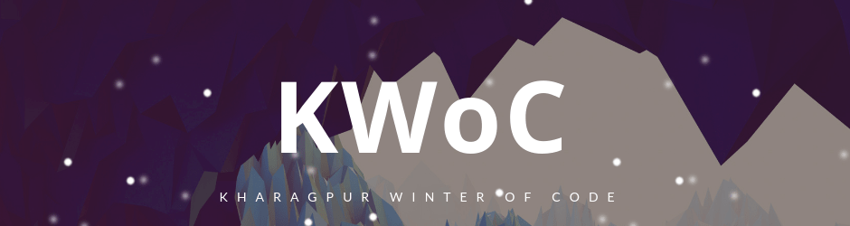
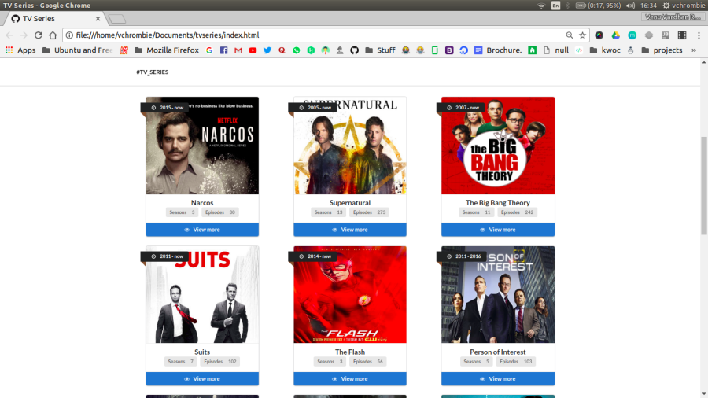
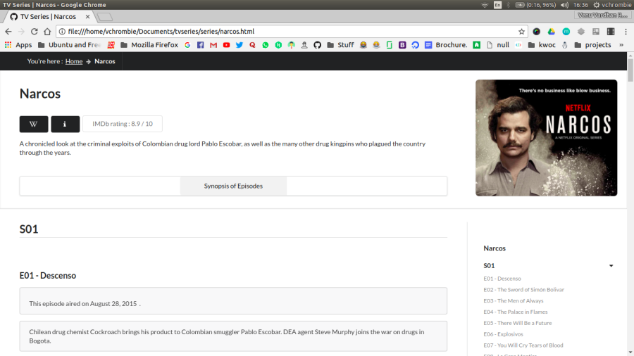
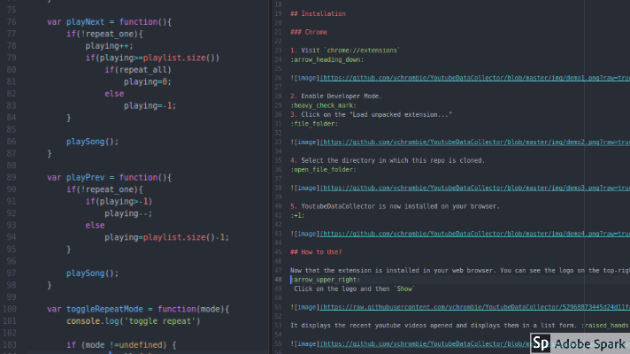
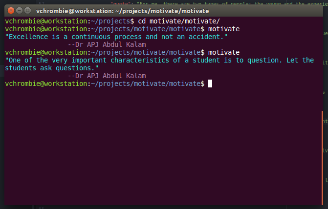
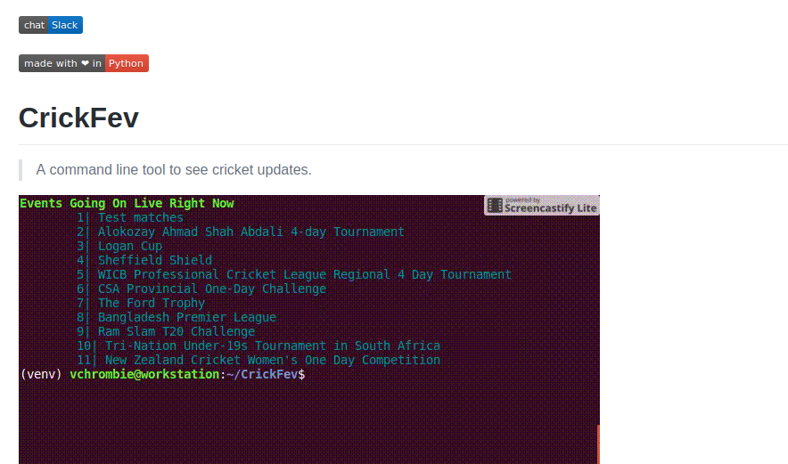
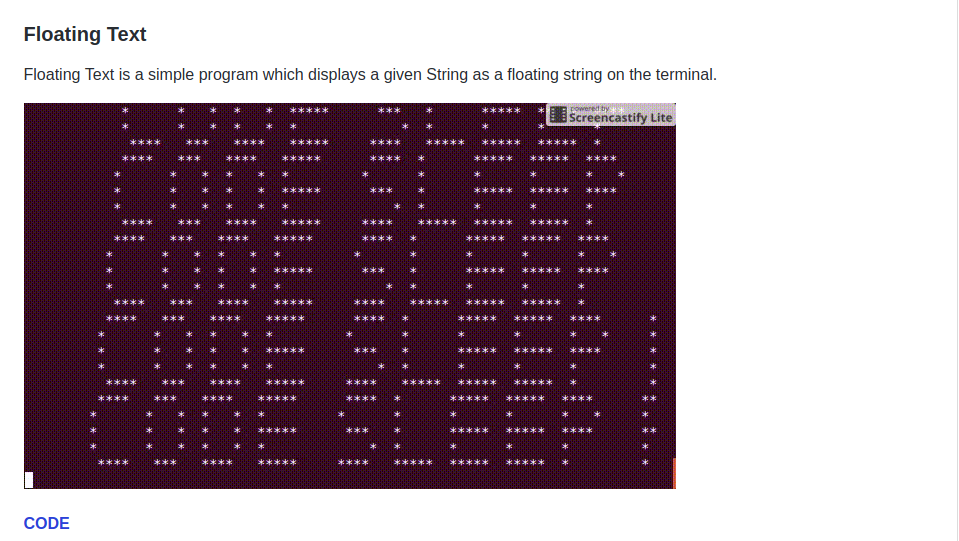
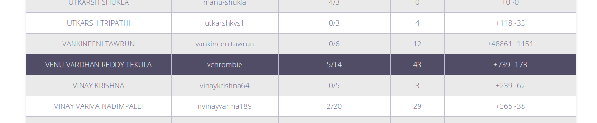

## About KWoC

Kharagpur Winter of Code is a 5-week long online programme for the students, who are new to open source software development. The programme not only helps students to get involved in open source but also helps them for many open source programmes, Google Summer of Code being one of them.

I wanted to take part in Google Summer of Code, but I was unaware of the procedures, working of the program which made me less confident. This program seemed like a stepping stone into the contribution to open source world. I went forward and registered, and did the initial formalities.

## Selecting the Project(s)

This all happened before November 26 itself and I had some time to have a look at the projects and select few of them. I was deeply impressed by **tvseries** and I was really interested to contribute to that project. I had contacted its mentor, Athitya Kumar and started working on the project.

Meanwhile, I was working on the documentation of the other projects so that I will get used to the workflow. I contributed to some other projects also like **fast_playlist**, **YoutubeDataCollector** and many more.

## Committing on GitHub

As soon as the calendar tick December 1, I started working on the projects. For the first two weeks, I was busy deploying the [tvseries](https://github.com/athityakumar/tvseries) project and fixing the existing bugs in that project. For the first two weeks, I have not made a single contribution to the project. But, I was in touch with its mentor, Athitya Kumar. He guided me all the way. The main concept of the project is to add web series episode synopsis to the website by Web Scraping in Ruby.

At last, in the third week, I was able to add one series. This gave me immense support to work further. After that, I was familiar with the codebase and I added two more web series. I added a web series in the fifth week also.

The [4 Pull Requests](https://github.com/athityakumar/tvseries/pulls/vchrombie) are still to be merged and I am hoping it will be merged in the near future. Closed [2 Pull Requests](https://github.com/athityakumar/tvseries/pulls?q=is%3Apr+author%3Avchrombie+is%3Aclosed).

*(You can refer [[3]](/blog/kwoc/2017/12/22/kwoc-week3/) [[4]](/blog/kwoc/2017/12/28/kwoc-week4/) [[5]](/blog/kwoc/2018/01/04/kwoc-week5/) for more clear info about my contributions to this project)*

Another project which fascinated me was [YoutubeDataCollector](https://github.com/Parth-Vader/YoutubeDataCollector). It is a browser extension which keeps a track of all the Youtube videos you have watched recently. Two things encouraged me to take it up. First, the idea blew off my mind. Second, it was an extension, so it gave me a scope to learn some new things. I contacted it's mentor, [@Parth-Vader](https://github.com/Parth-Vader) and started working on it. I made some changes in the UI of the extension. Designed a new logo and updated its documentation. I submitted [2 Pull Requests](https://github.com/Parth-Vader/YoutubeDataCollector/pulls?q=is%3Apr+author%3Avchrombie) and I am happy that both of them got merged. :)

Another project was, [fast_playlist](https://github.com/udiboy1209/fast_playlist).It is a web-app which helps you create a playlist of youtube songs really quickly. I implemented shuffle feature in this web app. Tried to implement Fishers Yated Akgorithm in this. The [PR](https://github.com/udiboy1209/fast_playlist/pulls/vchrombie) is not yet merged.

*(You can refer [[2]](/blog/kwoc/2017/12/16/kwoc-week2/) for more clear info about my contributions to the above two projects)*

Another project was [Code Sleep Python](https://github.com/prateekiiest/Code-Sleep-Python). The project is about adding some interesting python scripts. I added my floating text program to this project. I also fixed some typos in the documentation. I made the changes through [2 Pull Requests](https://github.com/prateekiiest/Code-Sleep-Python/pulls?q=is%3Apr+author%3Avchrombie) which got merged later.

I also added 20 quotes of **Dr. A. P. J. Abdul Kalam** to the project, [motivate](https://github.com/mubaris/motivate) through a [PR](https://github.com/mubaris/motivate/pulls?q=is%3Apr+author%3Avchrombie).

Apart from these, I contributed to [B.E.N.J.I.](https://github.com/the-ethan-hunt/B.E.N.J.I.), [CrickFev](https://github.com/sipah00/CrickFev) and [AirHockey](https://github.com/NITDgpOS/AirHockey) in their documentation part. These projects are also very interesting. Hope I will do some valuable contributions later to these projects. I did small changes like adding badges, uploading screenshots and modifying the documentation through [one](https://github.com/the-ethan-hunt/B.E.N.J.I./pulls?q=is%3Apr+author%3Avchrombie), [three](https://github.com/sipah00/CrickFev/pulls?q=is%3Apr+author%3Avchrombie) and [one](https://github.com/NITDgpOS/AirHockey/pulls?q=is%3Apr+author%3Avchrombie) Pull Requests respectively.

*(You can refer [[1]](/blog/kwoc/2017/12/07/kwoc-week1) for more clear info about my contributions to the above projects)*

I am little confused with this project, [awesome-social-science](https://github.com/icyflame/awesome-social-science). Here, I started to add some syndromes to the project but it's mentor asked me for a lot of changes and I was trying my level best. But atlast, my [2 Pull Requests](https://github.com/icyflame/awesome-social-science/pulls?q=is%3Apr+author%3Avchrombie) got closed but the changes were merged and gave me zero contributions from that project. Anyway, I am happy that the changes I made are in the official repo now.

## Summary :

The best part of the programme is that you will get to learn new things as you start working with these projects. I learn about web scraping, how to integrate algorithms in real life projects and many things.

**Stats till now:**

**No of Commits: 43**

**Pull Requests (Open/Closed): 5/14**

**Overall Lines Changed: +739 -178**

*(May alter as 5 Pull Requests are still pending which consists the majority of the work. The tvseries alone has +9,865 -266 pending to be reviewed.)*

**My GitHub Handle:** _[@vchrombie](https://github.com/vchrombie)_

It gives me immense happiness whenever I see my name on the leaderboard of the [KWoC'17 stats](https://kwoc.kossiitkgp.in/stats)

## Verdict

Thanks to all the mentors who have helped me. Huge thanks to [Athitya Kumar](https://www.facebook.com/athitya.kumar?fref=ts) for bearing my silly questions and addressing every single one of them. If it wasn’t him, this whole process would have taken weeks and the learning curve would have been tough. Lot more to learn from you. Also, I want to thank [Anirudh Murali](https://www.facebook.com/anirudh.en) who helped me a lot. Thanks again! 🙂

Also a big thank you IIT Kharagpur, KOSS for hosting a beginner friendly program, and making sure the learning is maximum. Hoping for more events like this in the future, and make sure it’s for all college students, so that people like me can be benefitted from it as well.

Cheers!! 😀
