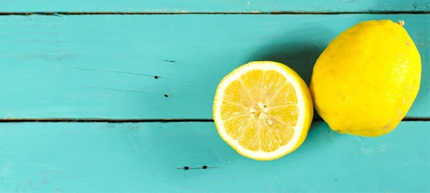
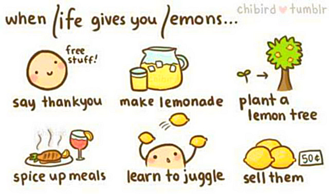
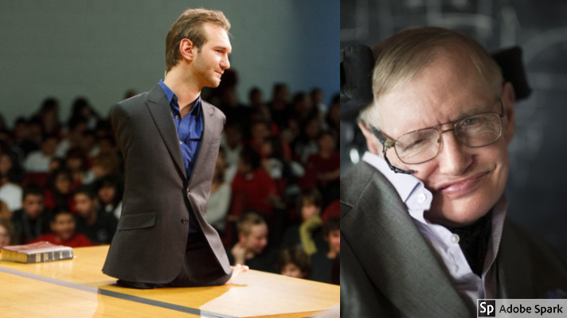

“When life gives you lemons, make lemonade.” This common phrase is meant to give an optimistic spin to everything. Lemons are quite sour, but can be made sweet and enjoyable with a dash of sugar and some water.

> If life was fair, I’d have everything. 

This is almost the story of every person. Now imagine if life was actually a bed of roses, every other person would be ruling, no one would know the meaning of fight, and winning without fighting is tasteless. Undoubtedly, *Life is not a bed of roses* but that does not mean we can’t make it a bed of roses. Similar is the meaning of this topic ‘If Life gives you lemons, make lemonade’. This topic depicts a hopeful and optimistic attitude towards life. When dealing with difficulties, every man thinks he is the most unlucky but little he know that every individual has to face problem in some course of life. Every problem contains a solution too, right? And in this case, the only thing that rejuvenates man, makes him courageous and empowers him to face the challenge valiantly is hope.

Life without limits is an autobiography of [Nick Vujicic](https://en.wikipedia.org/wiki/Nick_Vujicic), a young man born without limbs. For being different, people made fun of him, taunted him and he grew up fighting with his disorder all life. But he actually made lemonades out of lemon even in so many adversities. Instead of leading a depressed and low-spirited life, he preferred a meaningful life that could not only bring delight to his life but in others too. He started his non-profit organization [Life without limbs](https://www.lifewithoutlimbs.org/) and became a public speaker who gives everyone a message today that no matter what happens, there is always a hope and meaning in life. This example shows that one way to make lemonade out of lemons is by remaining grateful, calm and most of all hopeful.

[Stephen Hawking](http://www.hawking.org.uk/) is the most celebrated physicist, cosmologist, author and Director of Research at the Center for Theoretical Cosmology within the University of Cambridge. He is the symbol of courage for so many people who think life is not fair. Mr. Hawking is suffering from motor neuron disease. He is paralyzed and communicates through a “Speech Synthesizer” yet he has achieved such remarkable success which is dreamt by many.

Each of us has the potential to laugh in the face of adversities, to find the blessing in disguise and this potential, my fellows, is the prerequisite to turn the lemons into lemonades. So the next time trials come your way, drink it up. Be refreshed and renewed by what you have created with your lemons.

Cheers!!

Keep Smiling. :)
