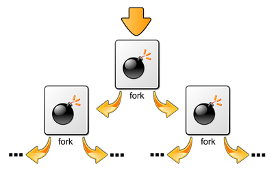

Hello People,

Wondering WTH I kept this post title and a featured image with some weird emojis?


Don't worry, I will clear all your doubts by the end of this #5 blog post.

Let me ask a question, Do you have any revenge to be taken on any of your friends? Seriously speaking, just type this so-called "Fork Bomb" code in their Terminal and run it. That's it, the game is over. He will go mad after seeing his system crashing in front of him.

I am just kidding.( not about the code part but about the revenge )

<p style="text-align: center;">⚠️ <strong><span style="text-decoration: underline; color: #ff0000;">Warning</span></strong> : What I have told you is absolutely true. So please do not try and drop yourself into trouble.</p>

A **fork bomb**, popularly known as **rabbit virus** or **wabbit** is a denial-of-service attack wherein a process continually replicates itself to deplete available system resources, slowing down or crashing the system due to resource starvation.



The code actually looks like this
```
:(){ :|: & };:
```
So now, I am gonna explain how this code actually works leading to the crashing of the system.


A fork bomb works by creating a large number of processes very quickly in order to saturate the available space in the list of processes kept by the computer's operating system. If the process table becomes saturated, no new programs may start until another process terminates. Even if that happens, it is not likely that a useful program may be started since the instances of the bomb program will each attempt to take any newly-available slot themselves.

Not only do fork bombs use space in the process table: each child process uses further processor-time and memory. As a result of this, the system and existing programs slow down and become much more unresponsive and difficult or even impossible to use.

In computing, **a fork** is an operation whereby a process creates a copy of itself.


Once a successful fork bomb is active in a system, one may have to reboot to resume normal operation. Stopping a fork bomb requires destroying all running instances of it.

It creates so many processes that the system is not able to create any more. Seems interesting, right? It even has the power to crash any Operating System. The renowned virus-free **Linux** is also a victim to this one line code.


I will provide you with some Examples :

- A fork bomb using the Microsoft Windows (any version) batch language (.bat):
```
%0|%0
```
Or a faster-reacting example:
```
:s
start %0
goto :s
```
- In Python:
```python
import os
while True:
     os.fork()
```
- Java can also be used, although the fork bomb will only work if the javaw executable is on the path.
```java
public class ForkBomb {
  public static void main(String[] args) {
    while(true) {
      Runtime.getRuntime().exec(new String[]{"javaw","-cp",System.getProperty("java.clclass.path"), "ForkBomb"});
    }
  }
}
```

Alternatively, stopping (“freezing”) the bomb's processes can be used so that a subsequent kill/killall can terminate them without any of the parts re-replicating due to newly available process slots:
```
killall -STOP processWithBombName
killall -KILL processWithBombName
```

**Prevention**: 
One way to prevent a fork bomb involves limiting the number of processes that a single user may own. On Linux, this can be achieved by using the *ulimit* utility; for example, the command `ulimit -u 30` would limit the affected user to a maximum of thirty owned processes. When a process tries to create another process and the owner of that process already owns more than the maximum, the creation fails. Administrators should set the maximum low enough so that if all the users who might simultaneously bomb a system do so, enough resources still remain to avoid disaster.

Have any queries, feel free to contact me

Venu :)
