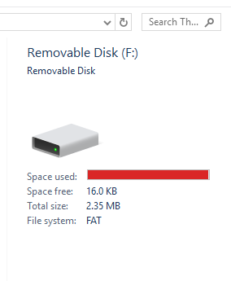
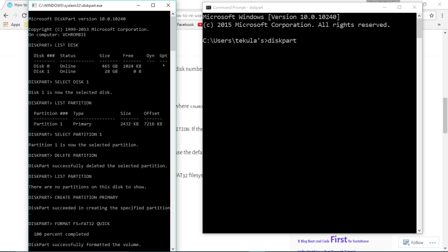
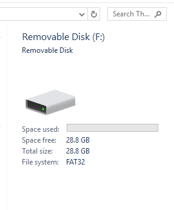

I recently made my pen-drive bootable with Ubuntu 16.04. But I need to unboot my pen-drive now. Even though I formatted my pen-drive thrice, the size of the pen-drive still shows 2.25 MB. Whereas, this is a 32GB pen-drive.

It looks like the picture below, somewhat...

So in this tutorial, I am gonna help you to solve this problem. Follow these steps

First of all, start administrator's command prompt:

- Type `cmd` in the search tab
- Press Ctrl+Shift+Enter to open the admin cmd
Open the utility called diskpart. I mean, enter `diskpart` command.

`DISKPART> `prompt should appear.

`LIST DISK`
Now in diskpart prompt, type the command and it will list all your disks including your USB drive. Note the Disk number.

`SELECT DISK #`
Type the command, where `#` is your USB disk number. Just look for the right capacity of the drive.

`LIST PARTITION`
List all partitions on it.

`SELECT PARTITION #`
For every one of them type:  , where `#` is the number of partition and `DELETE PARTITION`.

`LIST PARTITION`
Now check there aren't any of partitions left. If there aren't any create one partition.

`CREATE PARTITION PRIMARY`
If it asks about size, just use the default value. It is the max capacity.

`FORMAT FS=FAT32 QUICK`
USB flash drives use FAT32 filesystem by default. You could use NTFS instead too.

Here is a screenshot for your reference..

After following the series of these steps, you will find the problem fixed and the USB drive looks like this...

That's it!

Venu
