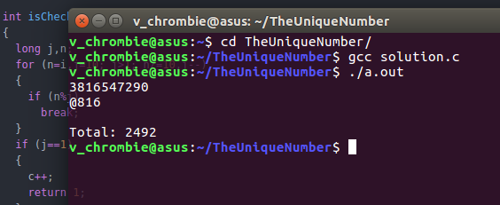

For about five days back, our CIR (Quants) madam, came to our class, as usual, bringing some typical questions with her. She then got on to the dais and asked a question. in her sweet tone, as "Find a ten digit number whose first two digits are divisible by 2, three digits by 3, four digits by 4 and so on..  and such that each digit must be used only once!"


While everyone was in a hurry to solve the problem and become the *cool guy* of the class, I was sitting in the fourth bench making some conclusions on my paper ( please don't expect too much 😐).


The only possible conclusion I could make was " **It is divisible by 10. Thus the last digit must be a 0.** " and I was like "*Yoo Venu! you have solved the 1/10 th part of the question.* 😎✌" Ad what I could possibly do now is try for the remaining 9/10 th of the question!


While I was trying for the remaining 9/10 th of the question, a guy from the back came up with an answer, "**3816547290**" and the mam says, "*It is the correct answer!*" and I was like, "*Not a big deal, I could have solved that if I had a brain faster than Google*" (being optimistic is good for mental health).

Now I will get to the main thing that is I asked myself a question, "*Why should I try solving this? Can't my friend (laptop) solve this problem?*" and I believed in my friend and started working to solve this problem in a code. After having some references like StackOverflow and with the help of my friends, I could break the problem into two steps
1. **isCheck** - the number should agree with the condition "first 'n' digits should be divisible by n".
2. **isLucky** - if the number is Lucky i.e, no digit should repeat.


My approach is that I will run a code that checks these two conditions 1 and 2 from a range of all 10 digit numbers and prints the required answer (intersection of both the conditions) on the terminal.


Clearing STEP 1

I wrote my step 1 code taking into consideration that the following problem follows a regular pattern (i+=90) and check my divisibility condition within a for loop

```c
for (n=i,j=10; j>1; n/=10,j--) {
if (n%j)
break;
}
if (j==1)
  return 1;
else
  return 0;
```

Clearing STEP 2

Somehow I could clear step 1 with a huge list of 2492 numbers satisfying the first condition. Now my task is to find that number which does not have a repetitive digit in it which is further solved by using Lucky number algorithm in which we do some tricky things with the array and the checking conditions to find the non-repetitive digit number.

```c
int arr[10];
for (int i=0; i<10; i++) arr[i] = 0; while (n > 0) {
int digit = n%10;
if (arr[digit])
  return 0;
arr[digit] = 1;
n = n/10;
}
return 1;
```

Finally after compiling and running the 60 lines of code, gave me this



In the above picture, 2492 says the count of numbers that passed step 1 and 816 ( my lucky number as always ) says the position of **The Unique Number** among those numbers.

If you want to have a look at my code, here it is, [The Unique Number](https://github.com/vchrombie/Misc/blob/master/solution.c)

In the Hope that you may find it interesting, :)

Untill next time.
