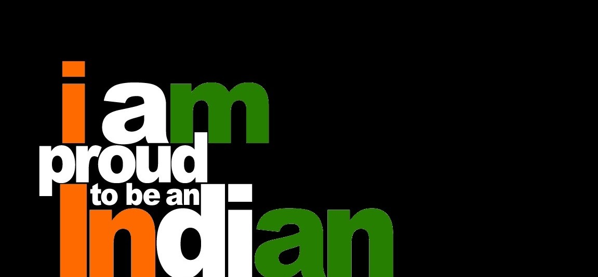

Hi everyone!

So, this time I came up with the topic, *"Why should we be proud of being Indians?*

There are many points that would suit this question. I list down a few.

- In the history of this world, India is the only country which never invaded any country.
- Till 1896, India was the only source of diamonds in the world.
- Number “zero” was invented by Aryabhatta, an Indian mathematician.
- One out of 5 individuals in the world are Indians.
- India has the 2nd largest pool of scientists and engineers.
- World's first University was established in Takshila in 700 BC.
- Muhammad Ghori invaded India 17 times to exploit India's wealth, this shows India was unimaginably prosperous.
- India has the world's highest post office at Hikkim, Himachal Pradesh at an altitude of 4440 m. Largest number of post offices too.
- Buddhism and Jainism both originated in India.
- India is the Largest Democracy in the world.
- India has been the largest contributor to the United Nations Peacekeeping Missions since its inception.
- India has more mosques (300,000 mosques) than any other nation in the world.
- Martial arts was first created in India.
- Indian women own 12% of the world's gold ornaments.
- India is the world's oldest, largest and continuos civilization.

These are some bits to speak about India. So many people, too many religions, yet every one enjoys equal freedom in following their tradition. Mother India showers such an unconditional love on us, that unity overpowers all our diversities. What so ever differences are there, we are bonded together by the single word “India”.

Here, I conclude.

1 Nation.

29 States.

7 Union Territories.

130 Cr. Peoples.

7 Religions.

122 Languages.

1600 Regional languages.

And still we are unitedly together.

We religiously together.

We culturally together.

We are diversly together.

We are bonded together.

Tell me the reason for which i shouldn't be proud of my mother land INDIA.

We are Indians.

Proud to be Indians.

Jai Hind ! Vande Mataram.
